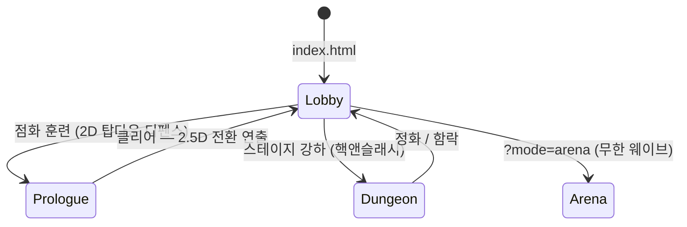

# Abyssal Lantern — Hold the Cinder Court

[](https://akillness.github.io/hongT/)
[](docs/RELEASE_NOTES.md)
[](https://unity.com)
[](https://akillness.github.io/hongT/)
[](Assets/Tests/EditMode)
[](https://github.com/akillness/hongT/deployments)

> 마지막 등불을 든 **Dusk Warden**이 되어, 등불의 기름을 태워 잿불 군단의
> 파도를 밀어내고 심연의 세 구역을 정화하는 **2.5D 핵앤슬래시 아레나 디펜스**.
> 브라우저 링크 하나로 즉시 실행 — 설치·로그인·서버 없음.

| | |
|---|---|
| **플레이** | <https://akillness.github.io/hongT/> |
| **원작** | [Abyssal-Lantern](https://github.com/jellyggumi/Abyssal-Lantern) (Canvas 2.5D, NAN 2026 제출본) — 수치 계약을 보존한 Unity 재구현 |

## 게임 구조 (v0.2.0)



- **로비** — 라이브 3D 배경(워든·동료·보스 대치) 위 성장/장비/군단 패널.
- **프롤로그** — 탑다운 오소그래픽 "2D 디펜스"로 조작·기름 경제를 학습.
  클리어하면 카메라가 55°로 내려오며 2.5D 던전이 열린다.
- **던전 (본편)** — 3콤보·대시·스킬 4종·원소 상성·정예 추출·동료 동행·
  보스 2페이즈·장비 드롭·레벨업. 스테이지 3구역:
  Cinder Span → Abyss Chancel → Echo Throne.

## 조작

| 입력 | 아레나/프롤로그 | 던전 |
|---|---|---|
| `WASD`/방향키 | 이동 | 이동 |
| `Space` | 타격 | **3타 콤보** (3타 넉백) |
| `Shift` | — | **대시** (무적 0.22 s, 기름 8) |
| `Q` | Ember Nova | **균열 화살** (원거리 볼트) |
| `E` | Lantern Ward | **묘지 파동** (지속 필드) |
| `R` | 재시작 | **잿불 노바** (360° 폭발) |
| `F` | — | **공허 방패** (흡수 40) |
| 터치 | 가상 패드 + 버튼 | 가상 패드 + 스킬 카드 |

## 시스템 (원작 이식 + 확장)

- **결정론 시뮬레이션** — 60 Hz 고정스텝 순수 C# (`CinderCourt.Sim`,
  UnityEngine 비참조). RNG 없음: 같은 입력 → 같은 결과.
- **원소 상성** — `ember > frost > veil > void > ember` (+20 % / −15 %),
  스킬에만 적용.
- **정예 추출** — 7번째 스폰마다 정예(HP×3). 처치 후 시체 곁 2 s 채널로
  **적을 동료로 추출** (`<visual>-echo`).
- **던전 기믹** — 잿불 분출구(주기 AoE) · 흑요석 기둥(이동 차단) ·
  유물 제단(스탠드 버프). 배치는 스테이지별 결정적.
- **메타 성장** — 스탯 포인트(공격/체력/이속), 장비 T0–T5(유물 구매),
  동료 로스터. localStorage 저장, 서버 전송 없음.
- **보스 연출** — 월드공간 말풍선(원작 스토리 대사), 2페이즈 전환,
  Monarch 호위 소환.

## 빌드 & 검증

```bash
# Unity 6000.5.6f1 필요 (URP 17.5)
bash tools/unity_batch.sh method CinderCourt.EditorTools.CharacterImportPipeline.ImportAll
bash tools/unity_batch.sh method CinderCourt.EditorTools.SceneBuilder.Build
bash tools/unity_batch.sh tests     # EditMode 61 (아레나 20 + 캠페인 10 + 핵앤슬래시 31)
bash tools/unity_batch.sh build     # build-webgl/
python3 -m http.server 4173 --directory build-webgl
```

심 어셈블리는 Unity 없이도 검증된다: `dotnet test` 임시 프로젝트로 동일
테스트 전부 실행 가능 (순수 C#).

### 자산 파이프라인

| 자산 | 도구 | 스크립트 |
|---|---|---|
| 3D 캐릭터 재스키닝 | Blender 5.x headless | `tools/blender/reskin_all.sh` |
| 애니메이션 | Mixamo FBX → Unity Humanoid 리타겟 | `Assets/Editor/CharacterImportPipeline.cs` |
| SFX/BGM | ElevenLabs sound-generation | `tools/audio/gen_sfx.py` |
| 한국어 폰트 서브셋 | fontTools | `tools/gen_hud_font.sh` |
| 배포 | gh-pages worktree | `tools/deploy/deploy_pages.sh` |

## 문서

- [docs/SIM_SPEC.md](docs/SIM_SPEC.md) — 동결 수치 계약 (아레나)
- [docs/SIM_SPEC_CAMPAIGN.md](docs/SIM_SPEC_CAMPAIGN.md) — 캠페인 증보 (v0.1)
- [docs/SIM_SPEC_HACKSLASH.md](docs/SIM_SPEC_HACKSLASH.md) — 핵앤슬래시 증보 (v0.2)
- [docs/RELEASE_NOTES.md](docs/RELEASE_NOTES.md) — 릴리즈 노트
- [docs/nan2026/](docs/nan2026/) — NAN 2026 해커톤 제출 문서

## 팀

**Hong팀** — 정장영 (기획·게임구현·리소스제작) · 이석민 (기획·UI·QA) ·
정우영 (기획·QA)
