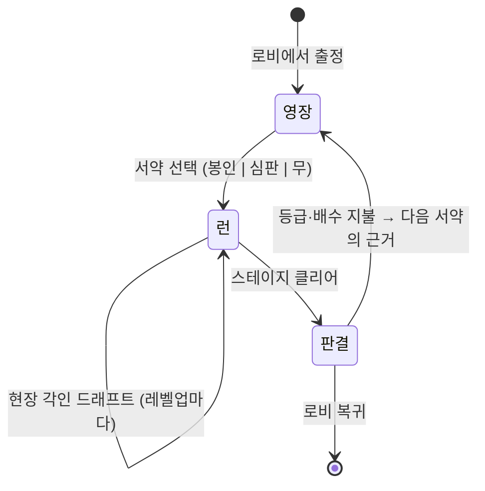

# 던전 재미 설계 — v3.1 「기믹 무기화」 (cycle-9 Stage 1b)

작성: game-designer. 근거: `.survey/dungeon-entry-fun-factors/`(15타이틀 ×
30메커니즘) + `.survey/sephiria-combat-system/`(Sephiria 8,058리뷰) +
`intake/production-brief.md` §측정(B1–B12) + `qa/benchmark-notes.md` v2.0.

**상태: 설계·범위·경제 전부 확정. 구현 대기.**
deep-interview `20260809-dungeon-fun-execution` 모호도 15% → 승인 라운드
2026-08-09에 미결 5건 전부 판정됨.

| 확정 항목 | 판정 | 근거 |
|---|---|---|
| 적용 범위 | **강하(던전) 전용** — 프롤로그·시련·아레나 제외 | D-22 |
| W4 옵트인 | **기본 적용** | D-23 |
| 선택 압력 목표 | **진행 밴드** 0.70/0.80/0.85 | D-24 |
| entry 17×19 순효과 | **의도** — 숙련 보상 축 + 상한 0.28 | D-25 |
| 경제 17·18·19 | **3인 서명 완료** | `pm/negotiation-record.md` |

**남은 차단 1건**: parity `[BEFORE]` 측정(D-26, 경성) — entry 17 착지 선행조건.

**v3.1 개정 (2026-08-09)**: 승인 반영 + 인용 87건을 머지된 `main` 기준으로
전수 재검증(행 범위 초과 0, 내용 불일치 0).

---

## −1. v2.0 → v3.0 개정 사유 (읽고 시작할 것)

**v2.0은 화면 두 개와 인게임 하나를 냈다.** 사용자 제보가 그것을 잡았다:

> *"현재 진행하는게 인게임내 수정하는거 맞아?"*

자기 설계표(§9)를 다시 읽으니 답이 이미 거기 있었다:

| v2.0 수 | 심 변경 | 전투 중 무언가 달라지나 |
|---|---|---|
| M-A 집행 영장 | 0 | **아니오** — 봉인해도 해저드·스폰·수치 전부 동일 |
| M-B 판결 등급 | 0 | **아니오** — 클리어 후 계산 |
| M-C 현장 각인 | 옵트인 | 예 |

**셋 중 하나만 인게임이었고, 그 하나를 S2로 미뤄뒀다.** 제보는 "게임성과
던전 자체가 재미없다"였는데 화면을 먼저 놓은 것이다. 조사가 그러지 말라고
명시했는데도 — *"문턱 작업은 threshold를 개선하지만 빌드 표현 직무를 혼자
구제하지 못한다"*(레인 D 결론 3).

**더 나쁜 것**: 조사에서 찾아 적어놓고 설계에 반영하지 않은 항목이 있었다.

> **아레나 상호작용물이 압도적으로 반응형이다.** 플레이어가 아레나 변화를
> *개시*하게 하는 것은 2/15뿐이고, 나머지 전부에서 아레나는 회피 대상이며
> **그것이 정확히 "던전은 배경" 불만을 만든다.** — `solutions.md` Key Gaps

### v3.0의 범위

| 수 | 내용 | 상태 |
|---|---|---|
| **W1 겨냥 넉백** | 런처 피니셔 넉백 원점을 입력 방향 반대편으로 | **신규 — 이번 사이클** |
| **W2 기믹 처치 크레딧** | 벽·해류·분출구 처치에 이벤트+연출+기름 환급 | **신규 — 이번 사이클** |
| **W3 현장 각인** | = v2.0의 M-C. 무변경 | 이번 사이클 |
| **W4 적 스킬** | 잡몹 4아키타입 행동 분화 (해시+임계+천장) | **신규 — 이번 사이클** |
| M-A 집행 영장 | §2 그대로 유지 | **cycle-10 이월** |
| M-B 판결 등급 | §3 그대로 유지 | **cycle-10 이월** |

**§2·§3은 삭제하지 않는다** — 설계는 유효하고 구현 시점만 밀렸다.
아래 본문에서 "이번 사이클"로 읽히는 M-A/M-B 서술은 전부 cycle-10으로
읽어야 한다.

### v3.0이 실측으로 정정한 것

1. **"기믹 6종 중 플레이어 이득은 제단 1종"은 부정확했다.** 벽
   (`CinderSim.cs:4124-4132`)과 해류는 **각인 없이도 적을 때린다**.
2. **진짜 결함은 겨냥 수단 부재다.** `Knockback`이 `KnockbackFrom(enemy,
   _player.X, _player.Y, ...)`을 호출한다(`:1514-1517`) — 넉백은 **항상
   나로부터 멀어지는 방향**이다. 적을 벽으로 밀려면 내가 벽 반대편에 서야
   하고, 그 우회로를 아무도 가르쳐주지 않는다. **재료는 다 있고 손잡이가
   없었다.**
3. **W1의 골든 비용은 던전 12행이다.** 골든 파일럿(`CampaignSimTests.
   BotInput:146-147`)이 카이팅하며 `MoveX/MoveY`를 채우고
   `ResolveFinisherVariant`(`CinderSim.cs:2496`)가 그 값을 읽는다 —
   **파일럿은 이미 방향 피니셔를 발동시키고 있다.** 아레나·프롤로그 3행은
   `_dungeon` 게이트 뒤라 불변.

### W4 — "확률로 스킬"을 무RNG로

사용자 요구: *"몬스터들이 일정 확률로 스킬을 쓴다든지"*.

**신규 발명이 아니라 기존 선례 2개의 조합이다** `[OBSERVED]`:

| 선례 | 위치 | 준 것 |
|---|---|---|
| 보스 아키타입 표 | `DungeonProgressionSpec.cs:649-719` (AMD #16) | 4아키타입 × 3페이즈 × 5축, **난수 0**. W4의 형태 |
| 결정론적 굴림 | 같은 파일 `:406-418` (AMD #14) | `Roll(id, wave, ordinal)` → 0..99 정수 어밸런치 |
| 천장 | 같은 파일 `:384-387` | FinePity 5 / EpicPity 18 |

→ `SkillRoll(enemyId, wave, attackOrdinal)` + 아키타입별 임계값 + 연속
미발동 천장. **플레이어에겐 확률로 보이고 심에는 난수가 0개다.**

현재 잡몹 실측: 시각 아키타입 4종인데 `SimTypes.cs:14`가 *"Visual archetype
only — combat numbers are identical"*이라고 적어 놨다. **보스는 행동 분화
층을 이미 갖고 있고 잡몹은 그 층이 통째로 없다.**

### 세피리아 조사가 준 경고

`.survey/sephiria-combat-system/` — 같은 장르 도트 로그라이트, 93.6% 긍정.

- **잡몹 행동 분화 0개로 93.6%를 냈다.** 난이도 13옵션 중 잡몹은 수·스탯·
  회복만 건드리고 패턴 강화(「전투 태세」)는 **보스 전용**이다.
  → **W4는 빈도로는 최강(0/15) 후보이고 근거로는 가장 약한 후보다.**
- **긍정 리뷰에서 전투 손맛은 5.5%로 최소** 항목이다(빌드·시너지 33.8% 최대).
- **"전투가 얕다"는 바운스 불만이다.** 20시간 이상 부정 리뷰에서 전투 깊이는
  0~1건. 그 1건도 *"다른 강력한 빌드가 없어서"*가 인과절 — **빌드 유효성
  불만이 전투 단조로움으로 표면화한 것**이고 정반대 처방을 요구한다.
  → W3(선택 압력 0.00 → 진행 밴드 0.70/0.80/0.85)이 그 처방이다.
    초안의 단일 임계 ≥0.75는 QA 센서스가 9/9 반증했다 — §4.2 참조.
- **결정론을 늘리면 잃은 의외성을 갚아야 한다.** 세피리아는 갚지 않았고
  사전 확정 빌드 불만이 **88% 부정**(5.1배 편향)으로 남았다.

---

## 0. 이 문서가 뒤집는 전제

지금까지 이 저장소는 **결정론을 제약으로 취급**했다. 무RNG를 지키느라 재미
장치를 포기하는 구도였다. 조사는 그 전제가 틀렸다고 답한다.

| 조사가 확인한 것 | 근거 |
|---|---|
| 카탈로그 30종 중 **런타임 난수를 요구하는 것 0종** | `solutions.md` 무RNG 교차표 |
| 참신 판정 3종(완전정보 텔레그래프 2/15 · 푸시유어럭 2/15 · 스테이지 등급 2/15)이 **전부 결정론 친화적** | 같은 표 |
| **정보를 가격 축으로 파는 것**이 분야 최대 공백이고, 그것은 **완전 결정론 심에서만 정직하게 가능** | `solutions.md` Key Gaps 마지막 항목 |
| 예측 가능성을 이유로 게임을 비난한 플레이어 인용 **0건**. 결정할 것이 없다는 비난은 다수 | `context.md` User Voices |

**결론: 무RNG는 비용이 아니라 미개척 우위다.** 이 스펙은 결정론을 지키는
설계가 아니라 **결정론이 있어야만 가능한 설계**다.

### 진짜 결함 — 안무는 있는데 안무가가 없다

Slay the Spire는 같은 시드가 같은 런을 만들지 않는다. 난수를 미리 뽑아두지
않고 **필요할 때 소비**하기 때문에, 플레이어의 다른 선택이 고정 수열의
**읽기 위치를 옮긴다** (`solutions.md` Tier 1/2 근거).

우리 스폰 인덱스는 `(wave*3 + id*3) % 8`이다. **플레이어 항이 하나도 없다.**
결정론이 죽은 것이 아니라, 결정론이 **플레이어와 연결돼 있지 않다.**

> 고정 시간표는 그것이 **유일한 변수일 때 부채**이고, 다른 변수들이 그것을
> 배경으로 움직일 때 **자산**이다. — `solutions.md` Contradictions

그리고 Into the Breach가 기록한 완전 결정론의 실제 실패 모드는 지루함이
아니었다. **플레이어가 이 판이 죽었다고 정확히 계산하고 이탈하는 것**이었고,
그들이 출하한 답은 낮은 확률의 상방 전용 굴림 하나였다.

---

## 0.5 적용 범위 — 강하(던전) 전용 `[확정 2026-08-09, D-22]`

W1·W2·W3·W4 **전부 `_dungeon` 게이트 뒤**. 프롤로그·시련·아레나 무접촉.

조사 중 로비 진입점 4개를 심 직접 구동으로 측정했고 `[MEASURED]`, 두 곳이
후보였으나 둘 다 제외했다:

| 진입점 | GameMode | 적 | 기믹 | 강화 | 스킬 | 판정 |
|---|---|---:|---:|---|---|---|
| 출정(스테이지 9) | `Dungeon` | 웨이브 | 2~4 | ✓ | ✓ | **채택** |
| 점화 훈련 | `Prologue` | 4 | 0 | ✗ | **✗ 봉인** | 제외 (사용자 지시) |
| ○○ 시련 5종 | `Training` | **0** | 2~4 | ✓ | ✓ | 제외 (적 없음) |
| 아레나 | `Arena` | 무한 | 0 | ✗ | ✓ | 제외 (동결 계약) |

**제외 근거 요약** — 전문은 `production/decision-log.md` D-22:

- **시련**: 적 0마리. W1·W2·W4가 발동할 대상이 없다.
- **프롤로그**: 기믹 0개라 W1·W2 불가. W4는 적 4종이 이미 있어 가능했으나
  스킬이 봉인(`CinderSim.cs:1193`)이라 Possessed의 기름 흡수가 무의미하다 —
  기름을 쓸 수 없으므로 뺏겨도 잃는 것이 없다. 4종 중 3종만 유효.

**남는 부채**: 프롤로그 wave 1이 적 4종을 각 1마리씩 뱉는데 넷이 기계적으로
동일하다. **튜토리얼이 4종을 소개하면서 그 넷이 같다는 것도 가르친다.**
W4가 던전에서 성공할수록 이 역전이 커진다 — 다음 사이클 만료.

## 1. 설계 명제

**"던전을 배우는 게임"에서 "던전을 저작하고 그 숙달을 증명받는 게임"으로.**

세 수(手). 각각 실측 결함 1개를 닫고, 각각 미포화 축 1개를 점유한다.

| 수 | 닫는 결함 | 점유하는 축 | 빈도 |
|---|---|---|---|
| **M-A 집행 영장** — 문턱을 계약으로 | B3 입장 결정 0 | 정보를 가격으로 판다 | M15 2/15 |
| **M-B 판결 등급** — 클리어를 채점 | B10 목표에 판정 없음 | 스테이지별 등급 | M25 2/15 |
| **M-C 현장 각인** — 런 안에서 규칙을 저작 | B6·B7 오퍼 풀 3 | 역전된 저작권 배치 교정 | 선례 0건 |

---

## 2. M-A 「집행 영장」 — 문턱을 계약으로

### 2.1 서사 (worldview 정합)

법정에 드는 자는 **영장을 받는다.** 영장에는 이번 집행의 조건이 적혀 있고,
읽을 수도 있고 **봉인한 채 들어갈 수도** 있다. 봉인하고 들어간 자의 판결은
더 무겁게 쳐준다 — 법정은 준비 없이 선 자의 담대함을 계량한다.

명명은 §명명 규약("법정 관료제 어휘")을 따른다.

### 2.2 화면 — 컷신을 대체하지 않고 **컷신 앞에 선다**

현재 `GameDirector.StartDungeon`은 컷신 → 나레이션 → 말풍선으로 입장한다.
Returnal이 정확히 이 자리에서 비판받았다: 반복 사망 시 의무적 분위기 연출이
**"죽음의 교훈과 재시도 사이"**에 놓여 학습 루프를 갉는다
(`context.md` User Voices).

영장 화면은 컷신을 **지우지 않는다.** 컷신 앞에 서고, **첫 입력에 즉시
넘어간다.** 3판:

```
┌ 집행 영장 ─────────────────────────────────────┐
│ [좌] 예고 목록          [중] 서약           [우] 지불 │
│  이 스테이지의          봉인 / 심판          유물 배수 │
│  해저드 시간표          (택1 또는 무)        판결 등급 │
└───────────────────────────────────────────────┘
```

### 2.3 좌판 「예고 목록」 — 정보를 파는 물건

이 스테이지의 해저드 표를 **정확히** 보여준다. 추정이 아니라 참이다 —
무RNG 심이므로 예고가 거짓일 수 없다. 이것이 분야 공백을 여는 열쇠다.

표시 항목(전부 기존 `HazardConfig`에서 직독, 신규 심 필드 0개):

| 열 | 내용 | 출처 |
|---|---|---|
| 종류 | 분출구 / 기둥 / 제단 / 해류 / 방벽주 / 장벽 | `HazardKind` |
| 개수·위치 | 미니맵 상 마커 | `HazardConfig.X/Y` |
| 주기·예고 | "2.4초 주기, 0.8초 예고" | `CampaignSpec.Vent*` 등 |
| 대칭 여부 | "적에게도 작용" 배지 | 기믹별 상수 |
| 웨이브 수 | 5–9 | `HackConfig.Waves` |

**리듀스드모션·색맹 대비**: 마커는 형태로도 구분(원/사각/삼각), 색 단독 금지.

### 2.4 중판 「서약」 — 두 서약이 진행도를 양분한다

이것이 이 스펙의 중심이다.

조사 최대 공백은 **"첫 입장을 재미있게 만드는 타이틀이 없다"**였다. 강력한
문턱 메커니즘(Pact · Oath · Boss Stem Cell · Ascension)이 **전부 클리어 이후
해금**이라, 입장이 지루해서 떠나는 플레이어는 장르의 답을 **본 적이 없다.**

우리 심판 서약도 지금 정확히 그 상태다 — `_lobby.IsPactArmed`는 클리어한
스테이지에만 뜬다.

**해법: 미클리어 스테이지 전용 서약을 하나 더 만들어 진행도를 양분한다.**

| 스테이지 상태 | 가능한 서약 | 성격 | 근거 |
|---|---|---|---|
| **미클리어** | **봉인 서약** — 예고 목록을 **읽지 않고** 들어간다 | 정보 핸디캡 | 클라이밍 온사이트: 동일 루트를 사전 정보 유무로 다르게 등급 매김 (`direct page retrieval`) |
| **클리어 완료** | **심판 서약** — 강화 배치 + 유물 배수 (기존 v1.3) | 선언된 제약 | Hades Pact (`direct page retrieval`) |

두 서약은 **배타적이며 합집합이 전 진행도를 덮는다.** 구현은
`CampaignStore.ClearedMask` 비트 검사 1회다.

**봉인 서약이 온사이트인 이유 — 그리고 왜 악용되지 않는가**

클라이밍에서 온사이트는 루트당 **한 번만** 청구 가능하다. 한 번 오르면
그 다음부터는 레드포인트뿐이다. 우리도 같다:

> **봉인 서약의 보상은 미클리어 스테이지에서만 지급된다.**
> 클리어한 순간 그 스테이지의 봉인은 값이 0이 된다.

이미 외운 스테이지를 봉인해서 공짜 배수를 먹는 경로가 **구조적으로 없다.**
그리고 이것은 규칙 하나가 아니라 **성립 조건**이다 — 정보를 파는 상점은
그 정보를 아직 사지 않은 손님에게만 열 수 있다.

**봉인의 실제 효과 (심 무변경)**

봉인은 심을 건드리지 않는다. **좌판을 잠그고 배수 플래그를 세울 뿐**이다.
해저드 표도, 스폰도, 수치도 동일하다. 바뀌는 것은 플레이어가 아는 양뿐이다.
G6 관점에서 이보다 싼 난이도 축은 없다 — 프레임 비용 0, 밸런스 영향 0,
골든 영향 0.

### 2.5 우판 「지불」 — 계약이므로 대가가 먼저 적힌다

Hades가 Bounty를 **선고된 Heat에 묶어** 지불하는 것과 같은 문법.
조사가 확인한 실패 모드: 보상이 **화폐**면 무시되고 **빌드 파워**면
참여된다 (RoR2 산의 제단 vs Hades Infernal Trove, `indexed snippet`).

**수치는 designer↔PM 협상 대상이다. 아래는 designer 제안 상한/하한이고
M-A는 cycle-10 이월이므로 아직 상정되지 않았다** (§7.2).

### 2.6 문턱 = 프리플라이트 체크리스트

영장 화면의 절반은 결정이 아니라 **읽기**다. 항공 체크리스트는 반복되기
때문에 하중을 받는다 — 비가역 순간 직전에 **조작자 자신의 상태를 읽히게**
만드는 의식이다 (`direct page retrieval`).

현재 우리 입장은 **세계를 서술하고 플레이어에 대해서는 아무 말도 하지
않는다.** 뒤집는 것이 가장 싼 개선이고 신규 시스템이 0개다:

```
장착 각인   역류인(B) • 집행인(A)
스탯        공격 75.4 • 최대체력 180 • 이동 262
이 법정     해류 2줄 • 기둥 1 • 예고 점유율 75%
선택한 것   봉인 서약
받을 것     유물 ×N • 판결 등급 심사
```

---

## 3. M-B 「판결 등급」 — 클리어를 채점한다

### 3.1 왜 필요한가

B10: 룸 목표는 **표시 문자열**이고 판정이 없다. `witness-well`은 "우물의
증언이 꺼지기 전 기둥 사이 전선을 유지하라"고 적혀 있는데 심에는 증언도,
꺼짐도, 판정도 없다. 9스테이지의 실제 목표는 전부 하나다 — 다 죽여라.

조사: 이 분야는 *클리어 여부*와 *어느 난이도에서*를 재고 **얼마나 잘**은
거의 재지 않는다(2/15, 둘 다 부분적). 그리고 고정 시간표를 가진 3종(VS·HoT·
DMD)은 **아무도 그것을 숙달 채점과 짝짓지 않았다.**

> 고정 시간표 + 숙달 채점 + 플레이어 선택 수정자의 조합은 풀 어디에도 없다.

우리는 세 조각 중 둘을 이미 갖고 있다.

### 3.2 등급 정의 (전부 기존 심 노출값, 신규 필드 0개)

| 입력 | 출처 | 검증 |
|---|---|---|
| 피격 횟수 | `_waveHitsTaken` 합 | 이미 DDA가 쓴다 |
| 클리어 시간 | `_stageTime` | 존재 |
| 점수 | `_score` | 존재 |

등급 = 세 축의 결정론적 함수. **View 계산으로 충분하다 — 심 변경 0.**

par 시간은 **QA 실측 후 확정**한다. 지금 숫자를 적는 것은 §4r 위반이다
(임계값보다 그것을 재는 조건을 먼저 명명하라). QA에게 요청한 측정:
`qa/test-plan.md` 신규 항목 T9.

### 3.3 등급이 지불하는 것

Hades Infernal Gate 선례: 무피격 클리어 시 보상이 **증폭**되고, 실패해도
전무가 아니라 **격하**된다 (`direct page retrieval`). 전부-아니면-전무
관문은 회피된다는 것이 조사 결론이다.

→ 등급은 **유물 배수의 마지막 항**이고, 최저 등급도 1.0 미만으로 내려가지
않는다. 벌금이 아니라 상여다.

---

## 4. M-C 「현장 각인」 — 런 안에서 규칙을 저작한다

### 4.1 역전된 저작권 배치 (조사가 명명한 결함)

VS와 HoT는 **둘 다** 같은 배치로 출하한다:

| | 런 밖 (영구·환불 가능) | 런 안 (사망 시 소멸) |
|---|---|---|
| VS | PowerUps — 평탄 스탯, 런 골드로 구매 | 100+ 풀에서 3–4 드래프트, **행동 변경** |
| HoT | Blessings — 평탄 스탯, 환불 가능 | 4 특성, **풀이 런 중 증가** |
| **우리** | **각인 5종×A/B — 규칙 변경** | **3종 고정 스칼라** |

**우리는 정확히 뒤집혀 있다.** 그리고 조사 풀 15종 중 우리 방향으로 출하한
타이틀은 **0건**이다.

PoE Archnemesis가 증명이다: **동일한 수정자 콘텐츠**가 리그에서 플레이어가
조합할 때는 호평받았고, 3.18에서 코어로 강제되자 지속적 반발을 샀다.
콘텐츠가 아니라 **저작권**이 변수다.

### 4.2 선택 압력 — 진행 밴드 `[확정 D-24]`

정의: `선택압력 = 1 − (제시 수 / 풀 크기)`

**목표: 초반 ≥0.70 · 중반 ≥0.80 · 후반 ≥0.85.**

| 구간 | 스테이지 | 목표 | 채택 구성 실측 |
|---|---|---:|---:|
| 초반 | 0–2 | **≥0.70** | 0.727 ✅ |
| 중반 | 3–7 | **≥0.80** | 0.823~0.870 ✅ |
| 후반 | 8 | **≥0.85** | 0.897 ✅ |

구성: **크기 축 3단계 + 스탯 5종.** 크기 축은 Ember Rest 선례(3종×3변형×
2크기=18)를 따르고, 스탯 확장분 2종은 기름 재생·대시 쿨다운 — 둘 다
`HackSpec`에 이미 상수가 있다. 신규 어휘 0개(§4.3).

현재값은 **0.00**이다 — 제시 3, 풀 3. 압력 0은 선택이 아니라 슬라이더다.

#### 왜 단일 임계가 아닌가 — 초안 ≥0.75는 9/9 실패했다 `[MEASURED, 2026-08-09]`

`qa/selection-pressure-census.md`가 9스테이지 전수 산술로 초안을 반증했다.
**압력 0.400~0.727, 목표 달성 0/9.** 최고치(ash-march 0.727)조차 미달이다.

| # | stage | 기믹 종류 | 풀 | 압력 |
|---:|---|---|---:|---:|
| 0–2 | cinder-span · ember-gallery · abyss-chancel | vent만 | 5 | **0.400** |
| 3·6·7 | witness-well · cinder-sluice · ember-bastion | 2종 | 7 | 0.571 |
| 4·5 | echo-throne · ash-verdict | 3종 | 9 | 0.667 |
| 8 | ash-march | 4종 | 11 | 0.727 |

**원인은 §4.4의 필터다.** 스테이지 해저드로 각인을 거르면, 기믹이 1종뿐인
초반 스테이지는 각인 면이 2개뿐이라 풀이 5에서 막힌다. 필터가 상황 의존적
가치를 만드는 대가로 **풀 크기의 상한도 함께 정한다** — 초안은 그 결합을
계산하지 않았다.

QA가 레버 8종을 계산했고(`qa/selection-pressure-census.md` §레버 격자),
**단일 레버로 9/9를 넘기는 것은 필터 해제뿐이며 그것은 §4.4를 파괴한다.**
A3+B5(면×3크기 + 스탯5)조차 단일 임계 기준으로는 6/9다.

#### 남는 구조 부채 — 밴드는 이것을 해소하지 않는다

**압력이 가장 낮은 곳이 게임이 시작되는 곳이다** (초반 3스테이지 평균 0.400
vs 후반 0.623). 이것은 조사가 지목한 최대 공백 — *"첫 입장을 재미있게 만드는
타이틀이 없다"* — 의 **재생산**이다. 저작의 재미가 진행도에 비례해 열린다.

밴드는 미달을 합법화할 뿐 기울기를 펴지 않는다(§4u). 초반 스테이지에 기믹
종류를 늘리는 것이 유일한 구조적 해법인데 **G2 무변경 목표와 충돌**하고 예고
예산 재센서스가 붙는다.

| 부채 | 만료 | 해소 조건 |
|---|---|---|
| 초반 선택 압력이 구조적으로 최저 | cycle-10 이후 | §4.4 필터 재설계 또는 초반 기믹 종류 증가 |

#### 선례 — 선택지를 줄이는 것은 값이 매겨진 물건이다

Hades는 **선택지를 줄이는 것 자체를 난이도 조건으로 판다** — Approval Process,
랭크당 −1 옵션, 2/3 Heat (`direct page retrieval`). VS는 3–4/100+ (~0.97),
HoT는 4/증가형이다. **선택이 없는 보상은 이 분야가 난이도 상승으로 가격을
매긴 물건이다.**

### 4.3 풀을 어디서 얻는가 — 신규 어휘 0개

**이미 있는 것을 쓴다.** 각인 5종 × A/B면 = 규칙 변경 어휘 10개가
`CinderSim`에 **구현되어 있고 테스트되어 있다** (`_sigilWallEnemyTick`,
`_sigilVentEnemyDamage`, `_sigilCurrentPlayerPushMult`, `PylonAuraMultiplier`,
`_sigilAltarHoldSeconds`).

현장 각인 = **같은 훅을 더 작은 크기로, 런 한정으로** 건드리는 오퍼.

- 신규 기믹 종류 **0개**
- 신규 심 훅 **0개** (기존 5개 재사용)
- 신규 밸런스 공간 **0개** (영구 각인보다 작은 크기 안에서만)

### 4.4 오퍼 필터링 — 죽은 선택지를 만들지 않는다

벽이 없는 스테이지에서 "벽 피해 +8"은 죽은 오퍼다. → **풀은 그 스테이지의
실제 해저드 표로 필터링**한다. 스탯 3종은 항상 포함(하한 보장).

부수 효과가 설계 의도다: **스테이지마다 오퍼 풀이 다르다.** Sid Meier의
기준 — 흥미로운 결정은 **상황 의존적 가치**를 요구한다 — 를 구조가 자동으로
만족시킨다.

### 4.5 어느 3개를 보일 것인가 — StS 기법의 이식

**해시에 플레이어 항을 넣는다.** 이것이 §0에서 진단한 결함의 직접 수리다.

```
offerHash(stageId, level, kills, hitsTaken, slot)
```

`kills`와 `hitsTaken`은 **플레이어가 만드는 값**이다. 다르게 플레이하면 다른
오퍼를 본다. 똑같이 플레이하면 똑같은 오퍼를 본다 — 그것이 올바른 결정론이다.

기존 `PreparationHash`(Ember Rest)가 같은 형태의 선례이고, 저장소에 이미
있는 정수 어밸런치 해시를 그대로 쓴다. **런타임 난수 0개.**

### 4.6 정지 문제 — 조사가 확인한 우리만의 이상값

확인한 모든 서바이버류(Brotato · DMD · Soulstone Survivors · 20 Minutes
Till Dawn · VS)가 레벨업에서 **정지한다.** 만료되어 사라지는 오퍼는
라이브서비스/모바일 문맥에서만 문서화되며 **주도권 침해·FOMO 레버**로
비판된다. **출하된 액션 로그라이트 선례는 조사에서 발견되지 않았다 —
부재 자체가 발견이다** (`solutions.md` What People Actually Use).

우리는 5초 무정지 + 만료 시 `None` 자동 적용이다.

**단, 이 설계에는 기록된 이유가 있다** — `input-depth-spec.md` §5:
"선택 전까지 심은 계속 돈다. 멈추지 않는다." 정지는 AMENDMENT #9(timeScale 0)
계약과 얽히고, 콘솔이 이미 그 함정을 밟았다.

→ **이번 사이클에 정지로 바꾸지 않는다.** 대신 **G3·G4 측정 항목으로
승격**한다: 오퍼 수용률(제시 대비 1/2/3 입력 비율)을 재고, 만료율이 높으면
그때 정지 여부를 근거를 갖고 결정한다. 지금 바꾸면 §4q가 경고한
"만장일치로 통과한 결정"을 새로 만드는 셈이다.

측정이 먼저다. 이것은 미해결 항목이며 그렇게 표기한다.

---

## 5. 세 수가 하나의 루프인 이유



- **영장**이 "이번 판은 무엇이 다른가"를 선언하고,
- **현장 각인**이 그 선언을 런 안에서 전개하고,
- **판결 등급**이 그것이 잘 됐는지 채점하고,
- 그 채점이 **다음 영장의 근거**가 된다.

조사의 Key Insight — 재미는 **플레이어가 다음 30초의 위험을 결정하고, 그
결정이 사전 공표된 명료한 조건 위에서 이루어질 때** 생긴다 — 의 구조적 구현.

---

## 6. 하지 않는 것 (명시적 비목표)

| 안 하는 것 | 이유 |
|---|---|
| 절차적 경로 분기 | 방·문·이동이 전제. 우리는 단일 아레나 — 조사도 "이식 불가"로 판정 |
| 아이템 풀 무작위성 | 정체성 포기. 대체재는 **저작된 참신성**이며 받은 참신성과 다른 감정임을 인정하고 그렇게 말한다 |
| 신규 HazardKind | cycle-2가 이미 3종 추가. 이번 결함은 종류 부족이 아니라 저작 부재 |
| 신규 스테이지 | 9개로 충분. D4가 증명 — 단일 반복 아레나가 보상 효율이 높아도 다양한 레이아웃에 진다. 우리 답은 **같은 공간을 다르게 만드는 것** |
| 밸런스 수치 변경 | G2는 무변경이 목표. 움직이면 그 자체가 결함 |
| 레벨업 정지 전환 | §4.6 — 측정 먼저 |

---

## 7. 경제

### 7.1 이번 사이클 — 서명 완료

| entry | 항목 | 값 | 상태 |
|---|---|---|---|
| 17 | W2 기믹 처치 기름 환급 | r=4 · 상한 15% | **3인 서명** |
| 18 | W3 현장 각인 크기 | 영구 각인 효과의 ≤50% | **3인 서명** |
| 19 | W4 Possessed 기름 흡수 | −6 · 발동률 17.4% | **3인 서명** |

셋은 **한 협상에서** 서명했다 — 17·19가 같은 자원(기름)을 반대로 움직이고
18이 같은 순환(기름→스킬→클리어율→유물) 안에 있다. 전문은
`pm/negotiation-record.md` §서명 라운드.

**착지 차단 없음** — parity `[BEFORE]`가 D-28로 해제됐다. §17 참조.

### 7.2 cycle-10 이월 — M-A·M-B의 경제 (미상정)

M-A 영장·M-B 등급을 구현할 때 협상에 올릴 항목이다. **아직 entry 번호가
없다** — 상정 시점에 채번한다.

| 항목 | designer bound | 근거 |
|---|---|---|
| 봉인 서약 유물 배수 | 상한 **×1.3** | 심 무변경·프레임 0. 미클리어 한정이라 반복 경로 없음. 첫클리어 보너스(+6/+8/+10)와 중복 여부는 PM 판정 |
| 판결 등급 배수 | **하한 1.0, 상한 1.5** | 벌금 아닌 상여(Hades Infernal Gate 문법). 최저 등급도 1.0 미만 금지 |

> **정정 (v3.1)**: v3.0은 이 둘을 `entry 9–11`로 적었으나 **그 번호는 이미
> 다른 항목이 쓰고 있다** — 9=돌발 보상, 10=SANCTUM 배지, 11=각인 행 라벨.
> 세 번째로 적었던 "현장 각인 크기 상한"은 entry 18로 정식 상정·서명됐다.
> 채번하지 않은 제안에 번호를 붙여 인용한 것이 원인이다.

**PM이 답해야 하는 것** (cycle-10): 두 배수의 곱이 T5 도달 세션 밴드 [10,20]을
침식하는가. **G5 parity 재측정과 같은 계산에서 나와야 한다** — 분모가 이미
두 번 바뀌었으므로(cycle-8 도달률, cycle-9 환급) 따로 재면 정보원이 셋이
된다(§4i).

---

## 8. QA 대조 — 밴드 위반 사전 점검

`qa/benchmark-notes.md` v2.0 절 기준.

| 밴드 | 권고 | 이 설계 | 판정 |
|---|---|---|---|
| 첫 결정까지 시간 | 문턱 0초 / 인런 ≤45초 | 영장 = 문턱 0초 | **개선** (현재 문턱 결정 없음) |
| 스테이지당 선택 수 | 4–9, 하한 3 | 현장 각인 5–8 + 서약 1 = **6–9** | 밴드 내 |
| 선택 압력 | (신설) | 0.00 → **0.70/0.80/0.85 진행 밴드** | **초안 ≥0.75는 9/9 반증됨 (§4.2)** |
| 동시 예고 상한 | 3–4, 경성 5 | **무변경** — 신규 예고 기믹 0개 | 안전 |
| 예고 리드타임 | 350–700ms 일반 | 무변경(분출구 800ms) | 안전 |
| 스테이지 길이 | 4–8분 | **미측정** | **QA T9 측정 요청** |
| 보스 시간 비중 | 20–35% | **미측정** | **QA T9 측정 요청** |
| 보상 이벤트/분 | 1.5–3.0 | **미측정** | **QA T9 측정 요청** |

**미측정 3건을 미측정으로 적는다.** cycle-8 회고 §6이 정확히 이것을
요구했다 — 미측정을 미측정으로 적는 것은 옳고, 거기서 멈추지 않는 것도 옳다.

---

## 9. 심 계약 — 추가만, 골든 무이동이 전제

| 수 | 심 변경 | 골든 |
|---|---|---|
| M-A 영장 | **0** — 좌판은 `HazardConfig` 직독, 봉인은 View 플래그 | 무이동 (자명) |
| M-B 등급 | **0** — `_score`/`_stageTime`/피격 합에서 View 계산 | 무이동 (자명) |
| M-C 현장 각인 | `GrowthChoiceKind` 확장 + 오퍼 해시 | **옵트인 뒤 무이동이 증명 대상** |

M-C는 `DungeonProgressionSpec.cs` 선례를 따른다: 신규 오퍼 종류는
`DungeonProgressionConfig` 계열 옵트인 뒤에 두고, **기본값에서 풀은 기존
3종**이다. 미옵트인 경로가 바이트 동일이 아니면 설계가 틀린 것이다.

`IGrowthChoiceSnapshot`은 이미 존재한다 — **`IHackSnapshot`을 건드리지
않는다**(§1 동결). 노출 전 §1 절차대로 "이미 다른 스냅샷에 있는가"를 먼저
확인한다.

---

## 10. 검증 계약

| # | 항목 | 방법 |
|---|---|---|
| V1 | 봉인 서약이 심을 바꾸지 않음 | 봉인 on/off 두 심 락스텝 → **다이제스트 동일** |
| V2 | 봉인 보상이 클리어 후 0 | ClearedMask 비트별 지급 어서션 |
| V3 | 현장 각인 미옵트인 경로 무이동 | 골든 15행 바이트 동일 |
| V4 | 오퍼 해시가 플레이어 항에 반응 | 동일 스테이지·동일 레벨, `kills` 다른 두 심 → **오퍼 집합 상이** |
| V5 | 오퍼 결정론 | 동일 입력 2회 → 동일 오퍼 |
| V6 | 오퍼 필터가 죽은 선택지를 안 만듦 | 9스테이지 전수 — 제시 3개가 전부 그 스테이지 해저드에 유효 |
| V7 | 선택 압력 **진행 밴드** (초반 ≥0.70 · 중반 ≥0.80 · 후반 ≥0.85) | 스테이지별 풀 크기 센서스 — 기준선은 `qa/selection-pressure-census.md` |
| V8 | 예고 예산 무변경 | LCM 센서스 재실행 → 동시 ≤3·동종 ≤2 유지 |
| V9 | 등급 단조성 | 피격↓·시간↓·점수↑ → 등급 비감소 |
| V10 | 영장 화면 담김 | 지원 플로어 375×667에서 뷰포트 담김(§4r·§4s) |
| V11 | 폰트 | 신규 한글 → `gen_hud_font.sh` + `getBestCmap()` 검사(§4b). **사전 검증 완료 — §10.1** |
| V12 | 브라우저 스모크 | 4모드 중 최소 2 + **미클리어/클리어 두 상태**(§4l 편중 금지) |

**V4가 이 스펙의 핵심 어서션이다.** 통과하지 못하면 §0의 진단(결정론이
플레이어와 연결돼 있지 않다)을 고치지 못한 것이다.

**변이 증명**: §4q — 이견 없이 통과한 결정부터 겨눈다. 이 스펙에서 아무도
반대하지 않을 항목은 "봉인은 심을 안 바꾼다"와 "오퍼는 스테이지로
필터링한다"이다. **그 둘에 변이를 먼저 건다.**

## 10.1 폰트 사전 검증 `[OBSERVED — getBestCmap(), 2026-08-09]`

§4b는 새 기호를 쓰기 전에 소스 폰트 cmap을 확인하라고 요구한다. 제안 어휘
12군(집행 영장 · 예고 목록 · 서약 · 지불 · 봉인/심판 서약 · 판결 등급 ·
현장 각인 · 체크리스트 라벨 · 해저드명 6종 · 배지 · 단위)을
`NanumBarunGothic.otf`의 `getBestCmap()`(18,665 엔트리)에 대조했다.
**한글은 전부 존재 — MISSING 0.**

**그러나 검사가 §2.6 목업에서 결함 1건을 잡았다.** 초안이 항목 구분자로
`·`(U+00B7)를 썼는데 그 글자는 **소스에 없다** — cycle-4가 이미 밟은
함정이고 §4b가 이름까지 적어 둔 글자다. 워크스페이스 산문에서는
관례적으로 쓰이지만(HEAD 시점 `benchmark-notes.md`에만 178회),
**목업은 산문이 아니라 출하될 문자열의 초안**이므로 `•`(U+2022, 소스에
존재)로 교체했다.

일반화: **워크스페이스 문서 안에서도 "제안된 UI 문자열"은 산문과 다른
검사를 받아야 한다.** 두 종류가 같은 파일에 살기 때문에 파일 단위 검사는
이 결함을 구조적으로 못 잡는다 — §4s가 경고한 "검사기가 대상보다 좁으면
그 차집합은 영원히 사각"의 이 문서 버전이다.

---

## 11. 범위 확정 (deep-interview 20260809, 모호도 15%)

| 수 | 심 | 골든 | 이번 사이클 |
|---|---|---|---|
| **W1 겨냥 넉백** | 변경 (호출 인자) | **던전 12행 이동** | ✅ |
| **W2 기믹 처치 크레딧** | 이벤트 추가 | 던전 12행 (같은 행) | ✅ |
| **W3 현장 각인** | 옵트인 확장 | 미옵트인 무이동 | ✅ |
| **W4 적 스킬** | 변경 | 던전 12행 (같은 행) | ✅ |
| M-A 영장 (§2) | 0 | 무이동 | cycle-10 |
| M-B 등급 (§3) | 0 | 무이동 | cycle-10 |

**넷을 묶은 근거**: W1·W2·W4가 **같은 12행**을 움직인다. 골든 재고정은
사이클당 1회면 되므로 묶으면 증명 비용이 거의 안 늘고, 나누면 두 사이클에서
두 번 낸다.

**W1이 전제인 근거**: 겨냥이 없으면 W2(처치 크레딧)와 W4(적 행동)는
**우연에 대한 반응**이 된다. 적이 벽에서 죽는 것을 내가 의도할 수 없으면
크레딧은 로또 당첨 통지다.

---

## 12. W1 — 겨냥 넉백

### 12.1 결함

```
Knockback(ref enemy, distance, time)
  → KnockbackFrom(ref enemy, _player.X, _player.Y, distance, time)
```

`CinderSim.cs:1514-1517`. 넉백 방향이 **항상 나로부터 멀어지는 쪽**이다.
거리 120u, 피니셔 배수 `{중립 1.00, 런처 1.60, 후퇴 0.70, 회전 1.00}`
(`HackSpec:532, :602`) — 힘은 이미 있는데 **방향을 못 고른다.**

적을 벽으로 밀려면 벽 반대편에 서야 한다. 가능은 하지만 **위치 선정이라는
우회로로만 가능하고 아무도 안 가르쳐준다.** 조준할 수 없으니 조준하고
있다는 느낌이 없다.

### 12.2 설계

**런처 피니셔**(방향 입력 + 3타, 배수 ×1.60)의 넉백 원점을 `_player`가
아니라 **입력 방향의 반대편 가상점**으로 바꾼다.

```
원점 = (_player.X - moveX * L, _player.Y - moveY * L)
```

`KnockbackFrom`이 **이미 임의 원점을 받으므로 호출 인자만 바뀐다.**
`L`은 상수 1개(설계 제안: 넉백 거리와 같은 스케일). 신규 필드 0개.

- **중립·후퇴·회전 피니셔는 무변경** — 기존 3분기는 그대로다.
- 런처만 바뀌는 이유: ×1.60으로 **가장 세고**, 이미 "밀어내는" 정체성을
  가진 유일한 분기다. 넷 다 바꾸면 후퇴 베기(포위 탈출)의 의미가 사라진다.

### 12.3 대가

**던전 골든 12행이 움직인다.** 근거는 §−1의 3번. AMENDMENT #9 선례를
따라 **의도된 개정**으로 처리하고 §14의 분해 증명을 붙인다.

---

## 13. W2 — 기믹 처치 크레딧

### 13.1 결함

벽·해류·분출구가 적을 죽이면 **점수와 처치 크레딧은 이미 나온다**
(`CampaignSimTests:1002-1003`이 어서션으로 고정). 문제는 **조용하다**는
것이다 — 사람이 "내가 함정으로 죽였다"를 인지하지 못한다.

### 13.2 설계

| 축 | 내용 |
|---|---|
| 심 | 기믹 처치 시 전용 이벤트 1비트 (`SimEvents`) |
| 뷰 | 기믹별 처치 연출 + 사운드 |
| 보상 | **기름 환급** — 조사 F6: 화폐 보상은 무시되고 빌드 파워는 참여된다 |
| 상한 | **런당 총량 상한** = 처치 기름의 15%. entry 17 서명 완료 |

기름을 고른 이유: **이미 제단이 주는 자원**이라 새 통화가 아니고,
"함정으로 죽이면 스킬을 더 쓴다"는 루프가 W1과 직결된다.

### 13.3 경제 (PM 협상 — negotiation entry 12)

기존 기름 수급 대비 비율로 제시해야 한다:
제단 +18 / 6s 쿨 · 픽업 flask +35 · 처치 +6 (`SimConfig`).
**designer bound: 런당 총량이 제단 1개 스테이지 수급의 ≤50%.**
PM이 parity 밴드 침식 여부를 판정한다 — cycle-8 이월 1(G5 재측정)과
**같은 계산에서** 나와야 한다(§4i).

---

## 14. W4 — 적 스킬 (잡몹 행동 분화)

### 14.1 결함

`SimTypes.cs:14`가 자백한다 — *"Visual archetype only — combat numbers are
identical."* 잡몹 4종(EmberCohort/Scout/Shade/Possessed)이 **색과 속성만
다르고 전부 같은 한 대**를 친다. 공격 선택 로직은 없다(사거리·쿨다운·토큰뿐,
`:2959-2961`). 첫 공격 분산은 `id % 3` 3단계가 전부다(`:3574`).

반면 **보스는 아키타입 4종 × 페이즈 3 × 5축 프로파일 표**를 갖고 있다
(AMENDMENT #16). **보스에 있는 층이 잡몹에 없다.**

### 14.2 설계 — 무RNG 확률

```
roll = SkillRoll(enemyId, wave, attackOrdinal)   // 0..99, 정수 어밸런치
if roll >= ThresholdFor(archetype) || pity >= PityLimit:  스킬
else:                                                     평타
```

`LootGradeSpec.Roll`(`:406-418`)과 **같은 형태**를 쓴다 — 부동소수점 없음,
정적 상태 없음, 모든 런타임에서 재현 가능. 천장은 `Advance`와 같은
단조 카운터.

**해시 입력이 플레이어에게 보이는 값인 것이 중요하다**(cycle-3 S5:
불가시 게이지 금지). `enemyId`·`wave`·`attackOrdinal`은 전부 화면에 있거나
셀 수 있다.

### 14.3 미설계 — designer 후속 작업

**4아키타입이 각각 무엇을 하는지는 아직 설계 안 됐다.** 제약만 확정:

| 제약 | 근거 |
|---|---|
| **예고 기믹 수 증가 0** | cycle-3 S4. ash-march·cinder-sluice 예고 점유율 71–75% |
| 노출 에피소드 누적 ≤30% max HP | cycle-3 S3. 잡몹 피해를 늘리면 재계산 |
| 속성(Ember/Frost/Veil/Void)과 정합 | `ElementOf(visual)`이 이미 4종을 가른다 — **행동이 속성을 배신하면 안 된다** |
| 동시 공격 토큰 예산 안 | `DifficultyProfile.AttackTokens` |

**설계 힌트(세피리아 §5 특수 키워드)**: 동상 5중첩 → **빙결**(즉시 500%
피해 + 1초 기절). **누적이 임계에서 종류를 바꾸는 문법**은 무RNG와 완전
양립하고, 우리 속성 4종과 형태가 맞는다.

---

## 15. 검증 — 골든 변화 분해 (이번 사이클의 핵심)

골든은 "움직이면 회귀"라는 안전망인데 이번엔 **움직이는 게 정상**이다.
그러면 안전망이 그 사이클만 꺼진다. 대체물:

### 15.1 3단계 분해 재고정

| 단계 | 켜는 것 | 기록할 것 |
|---|---|---|
| 1 | W1만 | 12행 중 **어느 행이 얼마나** 움직였는가 |
| 2 | W1+W2 | 1단계 대비 **추가 변화분** |
| 3 | W1+W2+W4 | 2단계 대비 **추가 변화분** |

각 단계의 행 값을 전부 기록한다. **한 번에 켜고 한 번 재고정하면 "무엇이
무엇을 움직였는지" 영원히 알 수 없다.**

### 15.2 불변 조건 (모든 단계에서)

- `arena-hack` · `arena-frozen` · `prologue` **바이트 동일**
- W3 미옵트인 경로 **바이트 동일**
- 예고 예산 LCM 센서스 **무변경** (동시 ≤3 · 동종 ≤2)

### 15.3 변이 증명 (§4q — 합의 항목부터)

이 스펙에서 아무도 반대하지 않을 항목:
1. "W1은 아레나를 안 건드린다" → `_dungeon` 게이트를 제거하는 변이
2. "W4 해시는 결정론적이다" → 해시에 시간/프레임을 섞는 변이
3. "W2는 기존 점수를 안 바꾼다" → 점수 경로를 건드리는 변이

**그 셋에 변이를 먼저 건다.** cycle-8이 무방비 3건을 찾았고 전부 만장일치
결정이었다.

### 15.4 브라우저 스모크 (§4c·§4l)

- 최소 2모드 (던전 + 최소 1개 — 편중 금지)
- **적 4종이 실제로 다르게 행동하는 것을 육안 확인** — EditMode는 이것을
  구분하지 못한다(§4m: 정답과 오답이 같아지는 좌표계)
- W1 겨냥이 실제로 벽/분출구로 적을 보내는지 육안

---

## 16. 이번 사이클에 하지 않는 것

| 안 함 | 이유 |
|---|---|
| M-A 영장 · M-B 등급 구현 | 인게임 아님. 설계(§2·§3)는 유지, cycle-10 |
| 신규 HazardKind | cycle-2가 3종 추가. 결함은 종류가 아니라 저작 |
| 신규 스테이지 | 9개로 충분 |
| 의도적 밸런스 수치 조정 | G2 무변경 목표. W1·W4의 골든 이동과 별개 |
| 레벨업 정지 전환 | 오퍼 수용률 측정 먼저 |
| LobbyView / MetaScreenView 통합 | 이번 범위와 접점 0. `EquipNames` 한 줄만 정리 |
| par 시간 확정 | M-B와 함께 이월 |

---

## 17. 승인 상태 (2026-08-09 라운드 결과)

### 확정 5건

| # | 항목 | 판정 | 이 문서에 반영된 곳 |
|---|---|---|---|
| 1 | 적용 범위 | 강하(던전) 전용 | §0.5 |
| 2 | W4 옵트인 | 기본 적용 | `design/enemy-archetype-spec.md` §8 |
| 3 | 선택 압력 목표 | 진행 밴드 0.70/0.80/0.85 | §4.2 |
| 4 | entry 17×19 순효과 | 의도 — 숙련 보상 축 | `pm/reward-bands.md` |
| 5 | 경제 3건 서명 | 완료 | `pm/negotiation-record.md` §서명 라운드 |

### 착지 차단 — **해제됨** (D-28)

**parity `[BEFORE]` 측정 완료** (`qa/parity-before-census.md`):

```
카이팅(회피형)  r = 6.78  ->  14.2 세션   밴드 안
수거(탐욕형)   r = 18.55  ->   5.2 세션   하한 침식
```

`[AFTER]`와의 차이가 entry 17에 귀속된다 — 재측정 프로토콜(동일 봇 2종·
6앵커·6랭크·캡 600초)이 고정됐다. **단일 봇으로 재면 안 된다**: 어느 쪽을
골라도 답이 2.7배 달라진다.

측정이 부수적으로 부트스트랩 모델을 반증했다 — 수입 분산의 **85%가 행동**이고
랭크는 15%다. 기존 두 앵커(17.7 / 7.0)는 랭크의 양끝이 아니라 **행동의 양끝**
이었다. 자세한 것은 §D-28.

### 승인이 만든 신규 요구 2건

| # | 요구 | 소유 | 이유 |
|---|---|---|---|
| 1 | 기름 순수지를 **아키타입 회피율별로** 분리 측정 | qa | 단일 평균은 숙련 격차 질문에 답하지 못한다(D-25) |
| 2 | **Possessed 사망 전 접촉 횟수** 기록 | qa | `skill_gap_oil_net_max` 0.28이 `hits=2` 위에 서 있다. 4회면 설계값(0.274)이 상한에 닿는다 |

### 남는 부채 2건 — 이번 사이클이 의도적으로 남긴 것

| 부채 | 만료 | 왜 지금 안 고치는가 |
|---|---|---|
| 초반 선택 압력이 구조적으로 최저 | cycle-10 이후 | 유일한 해법(초반 기믹 종류 증가)이 G2 무변경 목표와 충돌하고 예고 예산 재센서스가 붙는다 |
| 튜토리얼이 적 4종 동일성을 가르침 | W4 착지 후 다음 사이클 | 프롤로그 §1 계약(`CinderSim.cs:1193`)을 건드리면 골든 3행이 함께 움직여 검증 범위가 두 배가 된다 |

둘 다 **이번 사이클이 만든 것이 아니라 드러낸 것**이다. 첫 번째는 필터 설계의
귀결이고, 두 번째는 원래 있던 것을 W4가 대비로 보이게 만든다.
