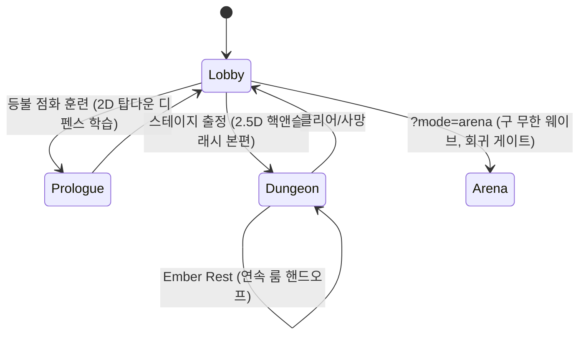

# 게임 기획 전체 분석 — Cinder Court (run-id 20260805-dungeon-gimmicks, Stage 1 intake)

작성: game-production-director. 근거: docs/SIM_SPEC*.md 3종 [OBSERVED],
Assets/Scripts/View/StageCatalog.cs [OBSERVED], cycle-1 회고 [OBSERVED],
deep-interview-cinder-court-dungeon-revival.md [OBSERVED].

## 1. 정체성

Abyssal Lantern — Cinder Court. 원작(Three.js 2.5D, NAN 2026 제출본)의 Unity
6000.5.6f1 + URP + WebGL 재구현. 핵심 하드 인바리언트: **결정론 60Hz 고정스텝
순수 C# 심**(`CinderCourt.Sim`, UnityEngine 금지, RNG 금지) / View는 심 상태
읽기 전용. 숫자가 게이트다 — 형용사 금지(CLAUDE.md §2).

## 2. 모드 구조 (단일 씬 상태머신)

- 프롤로그 = 온보딩 게이트(캠페인 해금 선행 조건). 스킬/대시 비활성.
- 아레나 = 원본 수치 계약 보존 구역. **회귀 금지**.

## 3. 코어 루프 (G7 관점)

인런(30–180s 대역 충족): 이동/콤보(58·58·87, 0.9s 링크) → 대시(무적 0.22s,
기름 8) → 스킬 4종(Q rift-bolt / E grave-pulse / R ash-nova / F void-aegis,
기름 경제) → 웨이브 클리어 → 픽업(HP/기름/유물) + XP 레벨업(캡 12) →
정예 추출(정지 2.0s 채널 → 로스터/버프) → 보스(W+1, 페이즈2) → StageCleared.

메타 루프: 클리어 +2pt(첫보스 +1) → 스탯 배분(공/체/이속, 캡 10) → 장비
T0–T5(인런 드롭 + 유물 구매 [2,4,7,11,16]) → 동료 1슬롯(보스 해금 + 추출
로스터) → 다음 스테이지 해금 체인. Ember Rest는 run-scoped 준비 상태(Stat/
SkillRune/GuardianResonance, Amendment #4 동결) — 영구 메타와 분리.

판정: 루프 구조는 완결. 액션수/보상이벤트/주기 모두 G7 대역 내 [INFERENCE —
repeat-rate 프록시는 측정 이력 없음, cycle-2 QA 항목].

## 4. 콘텐츠 현황 — 던전 6종의 실체

| # | id | 이름 | sim anchor | W | 기믹 | 보스 비주얼 |
|---|---|---|---|---|---|---|
| 0 | cinder-span | 재의 다리 | cinder-span | 5 | 없음(앵커 기본) | Commander |
| 1 | ember-gallery | 불씨 회랑 | cinder-span | 5 | vent×3 + pillar×1 | Commander(틴트) |
| 2 | abyss-chancel | 서약의 성당 | abyss-chancel | 6 | pillar×3 + vent×1(앵커) | Commander(틴트) |
| 3 | witness-well | 증언의 우물 | abyss-chancel | 6 | altar+pillar×2+vent×1 | Commander(틴트) |
| 4 | echo-throne | 메아리 왕좌 | echo-throne | 7 | altar+vent×2(앵커) | Monarch |
| 5 | ash-verdict | 재의 판결 | echo-throne | 7 | altar+vent×3 | Monarch(틴트) |

구조 [OBSERVED, StageCatalog.cs:100-138]: 논리 스테이지 6 = **sim anchor 3종
× HazardOverride 재배치 + 드레싱 테이블 + 보스 틴트/스케일**. 기믹 종류는
여전히 3종(ember-vent 주기 AoE / obsidian-pillar 이동 차단 / relic-altar
스탠드 버프)이 전부다.

## 5. 강점

1. **확장 시임이 이미 데이터 주도**: StageEntry(HazardOverride, TerrainId,
   AccentColor, Boss tint/scale, StoryKey, PrereqId 체인) — 신규 스테이지는
   카탈로그 행 추가로 로비 카드·해금·드레싱·보스 연출까지 관통한다.
2. **결정론 = 기믹 테스트 가능성**: 해저드는 전부 위상/모듈러 산술.
   신규 기믹도 digest 회귀로 기계 검증 가능.
3. **연출 어휘 축적**: cycle-1이 텔레그래프·풀 VFX·자막·리듀스드모션 문법을
   구축 — 신규 기믹의 가독성 비용이 낮다.
4. 원소 상성/정예/추출/동료 시스템이 살아 있으나 **기믹과 아직 미결합** —
   설계 여지.

## 6. 리스크 (cycle-2가 공략할 것)

1. **G8 참신성 적자**: 6스테이지가 동일 3기믹의 배치 조합 — 스테이지 간
   "기계적 차이"가 아니라 "지리적 차이"뿐. 신규 던전을 같은 방식으로 추가하면
   참신성 게이트를 구조적으로 통과 못 한다. → **신규 HazardKind가 사이클의
   본질**.
2. **진행도 마스크 상한**: `ValidClearMask = 0x3F`(6비트) [OBSERVED] — 스테이지
   추가는 마스크 확장 + localStorage v2 하위호환 마이그레이션 필수.
3. **Sim 동결**: HazardKind는 CampaignTypes.cs(FROZEN) 소속 — 증분은
   AMENDMENT 문서 + 동결 해제 목록 명시 패턴으로만. 위임 에이전트 편집 금지,
   메인 레인 전담.
4. 보스 비주얼 2종 재사용 한계 — 신규 스테이지도 틴트 변형에 머물면 스테이지
   정체성이 기믹에 전적으로 의존(= 기믹이 약하면 전부 약함).
5. 기믹 전부 "플레이어 리스크 단방향"(원작 정신) — 적에게도 작용하는 기믹은
   설계 결정 필요(협상 안건).

## 7. cycle-2 설계 방향 (Phase 1b 입력)

- 신규 던전은 **anchor 재사용 + 신규 HazardKind ≥2종**으로: 지리 변형이 아닌
  기계 변형. 각 던전 = 고유 기믹 1개가 지배하는 전술 문제.
- 기믹 후보는 서베이 빈도표(≤2/5 출현)로 참신성 사전 판정 후 확정.
- 기존 3기믹과 신규 기믹의 조합은 최종 스테이지 1개에서만 허용(복잡도 상한).
- 텔레그래프 계약 상속: telegraph ≥0.8s, 링/정적 인디케이터, reduced-motion
  대체 표시 필수.
- 진행도: ClearedMask 확장은 비트 추가(하위호환 — 기존 6비트 의미 불변).
