# Abyssal Lantern — Hack & Slash Overhaul (v0.2.0 Frozen Spec)

// FROZEN CONTRACT AMENDMENT #2 — 2026-08-04 인터뷰 확정.
// SIM_SPEC.md(아레나)와 SIM_SPEC_CAMPAIGN.md(캠페인 v0.1)는 유지된다.
// 이 문서는 v0.2.0 전면개편이 **추가/대체**하는 규칙을 정의한다.
// 원작 근거: _workspace 리서치 3종 (로비/RPG메타/3D인게임 리포트, 2026-08-04).

## 0. 모드와 상태머신 (단일 씬)



<!-- 원본: docs/assets/diagrams/hackslash-flow.mmd — 재생성:
     mmdc -i docs/assets/diagrams/hackslash-flow.mmd \
          -o docs/assets/diagrams/hackslash-flow.svg \
          -c docs/assets/diagrams/config.json -b transparent -->

- **씬은 CinderCourt.unity 하나.** `GameDirector`(View)가 상태 전환 소유.
- URL 계약: `index.html` → Lobby 부팅. `?mode=arena` → 구 무한 아레나(회귀 보존).
  `?mode=prologue`, `?mode=campaign&stage=<id>` → QA 딥링크(잠금 검사 통과 필요).
  `campaign.html` → `index.html` 즉시 리다이렉트로 교체(구 링크 보존).
- 시뮬레이션 모드 3종: `Arena`(기존 그대로, 회귀 게이트), `Prologue`, `Dungeon`.

## 1. Prologue — "등불 점화 훈련" (2D 디펜스 학습)

- 카메라: **수직 탑다운 오소그래픽** (pitch 90°, ortho size = 아레나 세로 반경
  ×1.15). 2D 디펜스로 읽힌다. 클리어 시 카메라가 55° 원근으로 내려오는 2.5D
  전환 연출(2.2 s) 후 로비 복귀.
- 규칙: 아레나 수치 계약 그대로(이동 218, 공격 58/160/0.48, 기름 등).
  스킬/대시/콤보 **비활성** — 이동+기본공격+기름 관찰만.
- 웨이브 3개: 4 / 6 / 8기. 기믹 없음. 보스 없음.
- 튜토리얼 토스트 4단계: 이동(WASD) → 타격(Space) → 기름 게이지 관찰 →
  "웨이브를 비우면 다음이 온다". 각 조건 충족 시 다음 토스트.
- 클리어 → `prologueDone=true` 저장, **캠페인 스테이지 해금은 프롤로그 클리어가
  선행 조건** (신규 유저 흐름: 프롤로그(2D 학습) → 던전(2.5D 본편)).

## 2. Dungeon 전투 킷 (핵엔슬래시)

던전 모드 전용. 아레나/프롤로그 수치는 불변.

### 2.1 기본 콤보 (Space)
| 타 | 피해 | 스윙 | 활성창 | 비고 |
|---|---|---|---|---|
| 1 | 58 | 0.30 s | [0.10, 0.22) | |
| 2 | 58 | 0.30 s | [0.10, 0.22) | |
| 3 | 87 | 0.42 s | [0.14, 0.30) | 넉백 120 px/0.18 s |
- 피해 표기는 **기본 공격력 58 기준 비율 1:1:1.5** — 구현은
  `playerDamage × {1,1,1.5}`이며 메타스탯/장비/레벨/추출 성장 배수가 곱해진다
  (a=w=0, lv=1에서 정확히 58/58/87).
- 콤보 연결: 스윙 종료 후 0.9 s 내 재입력 시 다음 타. 아니면 1타로 리셋.
- 사거리/전방 판정/1스윙 1피격 규칙은 아레나 계약 상속 (160, dx·facing≥-18).
- 던전 적 기본 HP `86 + min(140, (wave-1)*11)` (콤보 DPS 보정).

### 2.2 대시 (Shift)
`{ 거리 190 px, 시간 0.22 s, 무적 전구간, 쿨 1.6 s, 기름 8 }`
- 대시 중 이동 입력 방향(무입력 시 facing). 콤보 캔슬 가능. 아레나 클램프 적용.
- 이벤트 `DashUsed`.

### 2.3 스킬 4종 (Q/E/R/F — 원작 defense-catalog 이식, 비율 스케일)
| 키 | id | 원소 | 효과 | 쿨 | 기름 |
|---|---|---|---|---|---|
| Q | rift-bolt | void | 420 px 내 최근접 적에게 볼트: 145 피해 + 반경 115 스플래시 60% | 6.5 s | 25 |
| E | grave-pulse | ember | 자기 위치 지속 필드: 반경 190, 3 s, 0.5 s마다 26 | 4.0 s | 30 |
| R | ash-nova | ember | 360° 폭발: 반경 230, 110 피해, 넉백 120 | 8.0 s | 45 |
| F | void-aegis | frost | 실드 +40 (피해 흡수, 8 s 또는 소진), 시전 무적 0.2 s | 12.0 s | 30 |
- 스킬은 즉발(캐스팅 바 없음). AoE 링 표시는 **심 판정 반경과 동일**(원작이
  명시 수정한 결함 계승 금지).
- 원작 매핑: R=ash-nova가 구 Nova 계승(비용 45 동일), F=void-aegis가 구 Ward
  계승. 기존 SimInput의 NovaQueued→R, WardQueued→F 재사용, Q/E는 신규 필드.
- 이벤트: `BoltCast`, `PulseCast` 신설 (`NovaCast`/`WardCast` 재사용).

### 2.4 원소 상성 (원작 ELEMENT_MATCHUP 사이클)
`ember > frost > veil > void > ember`. 유리 +20%, 불리 −15%, 그 외 0.
- 적 원소: ember-cohort=ember, scout=frost, shade=veil, possessed=void,
  BossCommander=veil, BossMonarch=void.
- 기본공격/콤보는 무원소(중립). 스킬만 상성 적용.

### 2.5 인런 성장 (XP)
- XP: 일반 처치 10, 정예 25, 보스 150.
- 레벨 곡선(원작): [30, 55, 85, 120, 160, 205, 255, 310], 이후 +60/레벨. 캡 12.
- 레벨업 효과(즉시): 피해 +4%, 최대 HP +6(+6 회복), 기름재생 +0.3/s.
  이벤트 `LevelUp`.

## 3. 정예와 추출 (적을 베어 동료로)

- **정예 스폰**: 던전 웨이브에서 7번째 스폰마다 정예
  (`spawnOrdinal % 7 == 0`, 웨이브당 최대 1). 스탯: HP ×3, 접촉 ×1.5,
  스케일 ×1.35. 뷰: 금색 틴트 펄스.
- **추출**: 정예 사망 → 시체 마커 10 s 유지. 플레이어가 반경 90 px 내에서
  **정지 상태 2.0 s 연속 체류** → 추출 완료(채널 링 UI). 피격 시 채널 리셋.
- 보상: 신규면 로스터 등록(`<visual>-echo`) + 이번 런 피해 +8% 버프.
  중복이면 유물 +30. 웨이브당 추출 1회.
- 이벤트: `EliteDown`, `ExtractionComplete`.

## 4. 동료 (1슬롯 동행)

- 해금: 스테이지 보스 첫 처치 보상 — cinder-span→`ember-cohort`,
  abyss-chancel→`shade-echo`, echo-throne→`possessed-echo`.
  정예 추출 로스터도 장착 가능.
- 로비 군단 탭에서 1체 선택 → 던전 동행.
- 전투: 플레이어로부터 80 px 오프셋 추종, 1.1 s마다 200 px 내 최근접 적에게
  **플레이어 피해의 60%** (상성 무원소). 피격 대상 아님(untargetable).
- 뷰: **기존 7종 메시의 머티리얼 틴트 변형** (신규 메시 금지 — 페이로드 계약).
  동료는 **항상 틴트** (동일 메시 적과 즉시 구분): `-echo` 추출 변형 = 청록,
  보스 보상 동료 = 웜골드. 스케일 0.92.

## 5. 스탯 성장 (메타)

- 획득: 스테이지 클리어 +2 포인트, 보스 첫 처치 보너스 +1.
- 배분(로비 성장 탭): 공격(+3%/pt) · 체력(+8 HP/pt) · 이속(+2%/pt). 캡 각 10.
- 던전 런 시작 시 적용. 프롤로그/아레나엔 미적용.

## 6. 장비 티어 T1–T5 (기존 파편 3슬롯 확장)

- 슬롯 유지: weapon/lantern/cloak. **랭크 0-5 = T0-T5** (기존 효과식 유지:
  무기 +6%/T, 랜턴 +8%/T, 망토 +8HP/T).
- 획득 경로 2종: (a) 기존 인런 드롭(보스 확정 + id%7 파편), (b) **로비 구매**
  — 유물(relic) 화폐로 `[2,4,7,11,16]` 유물/티어.
- 유물은 이제 **메타 화폐**: 런 종료 시 `relics` 누적 저장, 로비에서 소비.

## 7. 보스전 개편

- 보스 웨이브 유지(웨이브 W+1). **AMENDMENT #4 — 3페이즈**로 개정:

  | 페이즈 | HP 구간 | 이속 | 범위 | 접촉 | 공격간격 | 텔레그래프 | 스킬쿨 |
  |---|---|---|---|---|---|---|---|
  | P1 | 100–50% | ×1.00 | ×1.00 | ×1.00 | 1.37s | 0.80s | 5.00s |
  | P2 | 50–20% | ×1.25 | ×1.10 | ×1.25 | 1.16s | 0.80s | 4.00s |
  | P3 | 20–0% | ×1.45 | ×1.20 | ×1.45 | 0.99s | 0.80s | 3.25s |

  시간합 7.17 → 5.96 → 5.04 **단조 감소** — "특징점 수치합이 작아질수록 강해진다"의
  구현이다. 텔레그래프는 전 페이즈 0.80s 고정(축소 금지: 난도 기여 3.2% 대
  반응마진 1.36×→1.15× 붕괴). 이속 ×1.45는 기저 ×0.7 위라 절대값 1.015 —
  일반 적 속도이며 플레이어(218 u/s)에게 따라잡히지 않는다.
  Monarch 한정: P2 전환 시 호위 3기 1회 소환.
  이벤트 `BossPhase2`는 **모든 경계**에서 발화한다(frozen `SimEvents`에 세 번째
  플래그를 추가하지 않기 위한 의도적 선택). 어느 페이즈인지는 스냅샷
  `BossPhase`(1/2/3)로 읽는다.
- **보스 HP: 던전 한정 `DungeonBossHealthMul = 6`** (`SimConfig.BossHealthMul` 위에
  곱). 실측 근거: mul=1이면 보스전 5.50s·P3 0.35s로 페이즈가 보이지 않는다.
  mul=6에서 19.28s·P3 2.73s(읽힘 하한 2.17s의 1.26×). 게이트는 `_dungeon`으로
  `UpdateBossPhase`와 동일 — 아레나·평캠페인 보스는 불변.
  상세: `_workspace/current/design/boss-phase-metric-definition.md` §7.
- 보스 HP 바: 화면 상단 대형 바 (이름 + 페이즈 핍 PHASE I/II/III, 페이즈별 색).
- 보스 처치 시: 기존 장비 드롭 + 동료 해금 + StageCleared.

## 8. 보스/스토리 말풍선 (원작 SpeechBubbleDirector 이식)

- 월드공간 말풍선 (보스/워든 머리 위), 데이터는 원작 stage-story-catalog 이식:
  | 트리거 | 화자 | 예 |
  |---|---|---|
  | 스테이지 시작 | 감시자(내레이션 캡션) | "서쪽 불씨를 버티고…" |
  | 보스 등장 | 보스 | "등불을 내려라." |
  | 보스 50% (P2) | 보스 | 도발 |
  | 보스 20% (P3) | 보스 | 최후 경고 (P2와 다른 대사) |
  | 보스 처치 | 워든 | 회고 |
- 홀드 `clamp(1500+58×글자수, 2200..5200) ms`, 우선순위 큐(story>ambient),
  상위 도착 시 하위 클리어. 폰트 서브셋에 대사 전 글자 포함 필수.

## 9. 로비 (단일 씬 Lobby 상태)

- **배경 = 라이브 3D**: 선택 스테이지 백드롭 + 워든 idle + 활성 동료 +
  해당 보스 'show' 루프(원거리 대치 스테이징). 카메라 슬로우 오빗(요 ±6°,
  24 s 랩). 스테이지 액센트 라이트 lerp (cinder #F3592C / chancel #8F67FF /
  throne #72C8FF — 원작 틴트).
- **우측 패널 (출정)**: 프롤로그 카드(미클리어 시 유일 활성) + 스테이지 카드
  3장(잠금/해금/클리어 + 보스명/웨이브/기믹 아이콘/보상 미리보기) + 출정 CTA.
- **좌측 패널 (탭 3개)**: 성장(포인트 배분 +/−) · 장비(3슬롯 T0-T5, 유물 구매)
  · 군단(로스터 그리드, 활성 동료 선택).
- **상단 바**: 타이틀 + 유물 잔액 + 포인트 잔액 + v0.2.0 배지.
- 결과 오버레이(클리어/사망)를 로비 복귀 전에 표시 (점수/처치/획득 요약).
- 접근성: 버튼 최소 44px, 색 단독 의미 금지(원작 계약 계승).

## 10. 레벨/연출 디테일

- 던전 카메라: pitch 55°/FOV 42(원작 검증 수치), 거리 2티어 —
  평시 17, 빅웨이브(생존 적 ≥10 또는 보스) 21, 전환 1.5 s 지수.
  보스 인트로: 1.2 s 푸시인 + 말풍선.
- 스테이지 라이트: 전역 릭 + 스테이지 틴트 lerp(원작 2층 구조).
  모든 포인트 라이트는 보이는 랜턴 프롭(실린더+발광)에 부착(motivated-light).
- 보스 웨이브 시작 시 아레나 클램프 15% 축소(deformation 문법, 원작 보스방
  계약). 텔레그래프 1.5 s (링 표시).
- VFX 추가: 대시 트레일(라인), 콤보 3타 스파크, 레벨업 버스트, 추출 채널 빔,
  정예 사망 마커. 풀 상한 40 + 크리티컬(보스/추출/레벨업) 축출 면제(원작 계약).

## 11. 지속성 (localStorage v2)

키 `"abyssal-lantern:unity:campaign"` 확장(하위호환 — 구 필드 유지):
```json
{"cleared":["cinder-span"],"equipment":{"weapon":2,"lantern":0,"cloak":1},
 "stats":{"attack":3,"vitality":2,"swiftness":0,"points":1},
 "relics":47,"roster":["ember-cohort","scout-echo"],"active":"ember-cohort",
 "prologueDone":true}
```

## 12. SimTypes 증분 (동결 해제 목록 — 이 외 수정 금지)

- `SimInput` 추가 필드: `DashQueued`, `BoltQueued`, `PulseQueued` (bool).
- **AMENDMENT #5 (입력 뎁스)** — `SimInput`에 2개 추가:
  `AttackHeld` (bool, **지속 상태**), `GrowthChoice` (int, 0=없음/1..3).
  둘 다 기본값이 `false`/`0`이므로 아레나·캠페인 다이제스트 불변.
- `SimEvents` 추가: `DashUsed=1<<14`, `BoltCast=1<<15`, `PulseCast=1<<16`,
  `LevelUp=1<<17`, `EliteDown=1<<18`, `ExtractionComplete=1<<19`,
  `BossPhase2=1<<20`, `ComboFinisher=1<<21`.
- 신규 `HackTypes.cs`: `GameMode`, `Element`, `HackConfig`(mode, stage,
  metaStats, equipTiers, companionId, hazards), `IHackSnapshot : ICampaignSnapshot`
  (Level, Xp, XpNext, ComboIndex, DashCooldown, SkillCooldowns[4], Shield,
  ElitesAlive, ExtractionProgress/Target, CompanionX/Y/Attacking, BossHp/BossMaxHp/
  BossPhase, Mode).
- `CinderSim`에 `CinderSim(in HackConfig)` 오버로드. 기본/캠페인 생성자 불변.


## 12.1 AMENDMENT #5 — 입력 뎁스 (차지 · 성장 선택)

전부 **던전 전용**(`_dungeon` 게이트). 아레나·프롤로그·평캠페인 불변.

### 12.1.1 홀드 차지 (§3)

- **누르는 순간은 지금과 동일하게 즉시 스윙한다.** 키를 누르고 있으면
  `InputAdapter`가 `isPressed`로 매 프레임 래치하므로 체인이 **자동으로
  1→2→3까지 진행**된다(기존 동작, 유지).
- 차지는 **3타 체인이 완료된 뒤**(`_comboIndex`가 0으로 돌아오고 링크 창이
  아직 열려 있을 때) 계속 누르고 있으면 쌓인다. 즉 홀드의 의미는
  "풀 콤보 → 그 다음 차지"다. 누름과 홀드가 같은 입력을 두고 경쟁하지 않으므로
  **연타 플레이어의 시뮬레이션은 비트 단위로 이전과 같다.**
- 차지가 존재하는 동안에는 링크 창이 만료돼도 체인이 재시작되지 않는다.
  그러지 않으면 무장(0.45s) 후 재시작(0.9s)까지 0.45초만 릴리스할 수 있다.
- 무장 시간 `ChargeReadySeconds = 0.45s`. 보스 텔레그래프(0.80s)보다 짧다 —
  선딜을 읽고 차지를 밀어넣을 시간이 남는다. EditMode가 이 관계를 고정한다.
- 완성 후 릴리스: 피해 `×1.8`, 넉백 `×2.0`. 사거리·판정각은 피니셔와 동일.
- **미완성 릴리스는 폐기**한다. 원하지 않은 스윙이 튀어나오지 않는다.
- 차지 중 이동 `×0.45`. 스윙 감속과 곱해지지 않는다(스윙이 차지를 0으로 만듦).
- 포즈는 기존 `critical` 클립 재사용. 신규 자산 없음.

### 12.1.2 성장 선택 (§5)

- 레벨업 시 오퍼가 열린다: `1 공격 / 2 생명 / 3 민첩`.
- **심은 멈추지 않는다.** 오퍼 중에도 전투가 계속 진행된다.
- `GrowthOfferSeconds = 5s` 후 자동 확정. 자동 확정은 **아무 것도 추가하지
  않으므로**, 무시하는 플레이어는 개정 전과 정확히 같은 자동 분배를 받는다.
  30초가 아니라 5초인 이유: 보스전 전체가 19초라, 30초 무스탯 구간은
  "무시해도 손해 없다"를 거짓으로 만든다.
- 오퍼 대기 중 다음 레벨업이 도착하면 **대기 중 오퍼를 즉시 자동 확정**하고
  교체한다. 큐를 쌓지 않는다 — 두 개가 밀리면 어느 레벨을 고르는지 알 수 없다.
- 축별 효과(포인트당):

  | 키 | 축 | 효과 |
  |---|---|---|
  | 1 | 공격 | 피해 `+8%` |
  | 2 | 생명 | 최대 HP `+6`, 즉시 회복 |
  | 3 | 민첩 | 이동 `+4%` **및 대시 쿨 `−6%`**(하한 `×0.55`) |

  민첩에 대시 쿨을 붙인 이유: 이동속도만 주면 셋 중 명백히 약한 선택이 되어
  실질 2지선다가 된다. 회피 주기를 바꿔야 방어적 선택이 성립한다.
- 노출: **`IHackSnapshot`을 개정하지 않는다.** `RunPreparationSnapshot.cs`의
  선례대로 `IGrowthChoiceSnapshot`(`GrowthOfferOpen`, `GrowthOfferTime`,
  `LastGrowthChoice`, `GrowthAttack/Vitality/Swiftness`)을 **추가**한다.
- 신규 `SimEvents` 없음 — 기존 `LevelUp`이 오퍼 개시와 같은 틱에 발화한다.

## 13. 결정론

전 모드 RNG 금지. 정예 판정·추출·동료 공격 주기 전부 모듈러/카운터 산술.
같은 config+입력 → 같은 Digest. 아레나 기존 20테스트 + 캠페인 10테스트는
회귀 게이트로 계속 통과해야 한다.

## 14. 릴리즈 (v0.2.0)

- README 개편: 배지(Play·Version v0.2.0·Unity 6000.5.6f1·Tests·Pages Deploy),
  게임 소개(KR), 조작표, 스크린샷, 빌드/테스트 방법, 페이지 구성.
- `docs/RELEASE_NOTES.md` v0.2.0 항목.
- git tag `v0.2.0` + `gh release create` (릴리즈 노트 + 플레이 영상 첨부).
- 배포: gh-pages 갱신 후 프로덕션 스모크.

## Frozen Contract Amendment #3 — Companion Hold / Recall (2026-08-04)

**Status: additive and frozen.** This amendment amends §§4, 12, and 13 only as
specified below. It supersedes only an incompatible interpretation of those
sections; every other existing companion, input, snapshot, determinism, and
mode contract remains in force.

### Scope and invariants

- Use the existing **Companion** noun. The controls apply only to the active
  configured companion in `Dungeon`; they are inert in `Arena`, `Prologue`, and
  any run with no active companion.
- `SimInput.CompanionHoldQueued` and `SimInput.CompanionRecallQueued` are
  additive, one-shot bool inputs. If both are queued in one simulation update,
  **recall wins**: both inputs are consumed and only recall takes effect.
- `CompanionBehavior.Hold` captures and locks the companion's current
  coordinates. While held, only follower movement is skipped. The companion
  still uses its existing nearest-target selection, 200 px range, 1.1 s
  cadence, player-damage ×60% neutral damage, and untargetable status from §4.
- `CompanionBehavior.Follow` is the default. Recall changes behavior to
  `Follow` and resumes the existing 80 px-offset follower movement on its
  normal update path; it must not teleport or otherwise relocate the companion.
- Holding an already held companion and recalling an already following
  companion are no-ops. `Restart` always resets behavior to `Follow`.

### SimTypes, snapshot, and migration

- §12's frozen `SimInput` list is extended only with
  `CompanionHoldQueued` and `CompanionRecallQueued` (bool).
- Add `CompanionBehavior { Follow, Hold }` and expose a public
  `CompanionBehavior` field on the hack/campaign snapshot surface. Every
  restored or migrated snapshot that lacks this field defaults to `Follow`.
- No `SimEvents` member or event semantics are added. §11 persistence is
  unchanged: companion behavior is neither saved nor restored as campaign
  progress.

### Explicit non-goals

- No companion skills, equipment, persistence, or cooldowns.
- No change to `GuardianResonance` effect semantics.
- No replacement of existing companion combat, follow distance, targeting,
  damage, or untargetability rules beyond skipping follower movement while held.

### Required deterministic proof before release

- A no-command `Dungeon` regression preserves its existing digest, and every
  legacy `Arena` and `Prologue` digest remains unchanged.
- An active `Dungeon` companion holds at the coordinates captured by hold while
  retaining its existing target/range/cadence/damage/untargetability behavior;
  recall resumes ordinary 80 px following without a teleport.
- Simultaneous hold and recall resolves to recall; redundant hold/recall
  commands are no-ops; restart resets `Follow`; and both commands are inert in
  `Arena`, `Prologue`, and runs without a companion.
- Snapshot construction and migration default an omitted behavior field to
  `Follow`, while a public snapshot exposes the current behavior; the controls
  introduce no `SimEvents` flag.
- Replaying identical complete config and hold/recall command sequences yields
  identical snapshots and digests.

## Frozen Contract Amendment #4 — Ember Rest Next-Room Preparation (2026-08-04)

**Status: additive and frozen.** This amendment defines the sole runtime meaning
of an Ember Rest `PreparationOffer`. It amends §§2–4, 12, and 13 only as
specified below. It preserves all frozen `Arena`, `Prologue`, and unselected
`Dungeon` behavior.

### Ownership, handoff, and lifetime

- `GameDirector` owns exactly one transient selected `PreparationOffer` for the
  next logical room. An Ember Rest selection replaces that one value; no
  selection is represented as `None`.
- On the next-stage handoff, `GameDirector` passes that exact selected offer
  into `HackConfig`. `HackConfig` owns the resulting room-local
  `PreparationOffer` value; it is not reconstructed from UI state, campaign
  state, or a second random selection.
- The offer is active only for that one destination `Dungeon` room. It applies
  from the room's configuration through the room end, then is consumed and
  discarded. It must not carry to a later room, retry, stage, or campaign.
- The selection and the `HackConfig` value are transient. They are not saved,
  restored, migrated, included in campaign progress, or exposed as persistent
  inventory, equipment, companion state, or an `IHackSnapshot` field.
- `None` and no Ember Rest selection are exact no-ops: they alter no
  `HackConfig` gameplay value, event, snapshot, digest, room routing, or
  persistent state.
- Ember Rest offer generation and its deterministic hash are unchanged. This
  amendment carries the already selected offer; it neither rehashes it nor
  changes its candidate set, ordering, seed inputs, or selection rule.

### Exact destination-Dungeon effects

Let `m` be the selected offer's existing magnitude, where `m ∈ {1, 2}`. All
effects in this section apply only when `HackConfig.Mode == Dungeon`; every
other mode treats the carried offer as inert.

- `Stat` variant 1, 2, or 3 targets `Attack`, `Vitality`, or `Swiftness`,
  respectively. Add `m` to that existing in-run preparation stat, capped at
  the existing maximum of 10:
  `preparedStat = min(10, existingStat + m)`. The other two stats are
  unchanged.
- `SkillRune` variant 1, 2, or 3 targets `Rift Bolt`, `Grave Pulse`, or `Ash
  Nova`, respectively. Its only effect is a damage multiplier
  `1 + 0.10 × m` on the selected skill in the destination Dungeon:
  `riftBoltDamage × (1 + 0.10 × m)`,
  `gravePulseTickDamage × (1 + 0.10 × m)`, or
  `ashNovaDamage × (1 + 0.10 × m)`. In particular, Grave Pulse modifies each
  tick, not its duration, interval, radius, cast cost, cooldown, or any
  non-tick value. The non-selected skills are unchanged.
- `GuardianResonance` variant 1, 2, or 3 targets companion cadence, range, or
  damage, respectively, and only in the destination Dungeon:
  `cadence = max(0.5 s, 1.1 s × (1 - 0.10 × m))`,
  `range = 200 px + 20 px × m`, or
  `damage = ordinaryCompanionDamage × (1 + 0.10 × m)`.
  The two non-selected companion values remain their ordinary §4 values.
  `ordinaryCompanionDamage` retains §4's player-damage ×60% neutral-damage
  basis before this multiplier.

### Compatibility and explicit non-goals

- This amendment supersedes **only** Amendment #3's “No change to
  `GuardianResonance` effect semantics” non-goal, and only for a selected,
  transient Ember Rest `GuardianResonance` offer under the exact formulas
  above.
- It does not alter the ordinary §4 companion combat contract or Amendment
  #3's hold/recall contract. In particular, absent that selected temporary
  offer, companion follow offset, target selection, cadence, range, damage,
  neutral element, untargetability, hold coordinates, recall behavior, and
  command precedence remain unchanged.
- It adds no persistence, progression reward, inventory item, equipment,
  cooldown, skill unlock, new random draw, `SimInput`, `SimEvents`, or
  cross-mode effect. It does not alter any damage, stat, or companion value in
  `Arena`, `Prologue`, a Dungeon without a selection, or a Dungeon configured
  with `None`.

### Required visible wording

The Ember Rest offer card and the selected-offer confirmation must name the
affected target and exact magnitude rather than describe a generic “boost”:

- `Attack +{m}`, `Vitality +{m}`, or `Swiftness +{m}` for `Stat`.
- `Rift Bolt +{10 × m}% damage`, `Grave Pulse +{10 × m}% tick damage`, or
  `Ash Nova +{10 × m}% damage` for `SkillRune`.
- `Companion cadence −{10 × m}% (min 0.5 s)`,
  `Companion range +{20 × m} px`, or
  `Companion damage +{10 × m}%` for `GuardianResonance`.

Each braced expression is rendered as its evaluated integer: `m = 1` yields
`+1`, `+10%`, or `+20 px`; `m = 2` yields `+2`, `+20%`, or `+40 px`.

### Required deterministic proof before release

- Every `Stat`, `SkillRune`, and `GuardianResonance` variant at magnitudes 1
  and 2 must apply only its stated destination-Dungeon formula, including the
  stat cap and the 0.5 s cadence floor.
- A selected offer must be present in the next destination `HackConfig`, stay
  active for that room only, and be absent after that room ends; it must never
  appear in save, restore, migration, campaign-progress, or snapshot data.
- No selection and `None` must preserve the existing Dungeon result exactly;
  all legacy `Arena` and `Prologue` digests must remain unchanged even when a
  carried offer is present.
- `GuardianResonance` must affect only the selected temporary preparation and
  leave ordinary §4 and Amendment #3 hold/recall behavior unchanged.
- Identical complete stage handoffs, selected offers, and simulation inputs
  must yield identical snapshots and digests. The deterministic Ember Rest
  offer hash must remain unchanged from before this amendment.

---

> **번호 충돌 — 병합자 판단 필요.** 두 레인이 각각 "Amendment #6"을 자칭한 채
> 도착했다: 바로 아래 **멀티슬롯 동료**(main, DRAFT)와 그 뒤의 **각인
> (Sigils)**. 내용은 겹치지 않으므로 둘 다 보존하되 **번호는 정하지 않았다** —
> 어느 쪽도 임의 재번호하지 않는다. 동료 증보를 `#6`으로 확정하면 각인은 `#7`,
> 훈련장·돌발은 `#8`로 밀린다.

## Frozen Contract Amendment #6 — DRAFT (multi-slot companions + per-companion stats)

**Status: DRAFT — implemented and proven; awaiting operator sign-off to freeze.**
The sim/view edits this amendment requires are **applied** (`HackConfig.
CompanionIds` + `CompanionSlots()`, `HackSpec.CompanionSlotFanout` /
`CompanionStats` / `CompanionArchetype`, `CinderSim` per-slot follower and
`IHackSnapshot` indexed accessors), and the D6.7 proofs below are implemented
as the `CompanionSlots_*` tests in `Assets/Tests/EditMode/HackSimTests.cs`.
The numbers below remain the gate the implementation and its tests reproduce.
Promotion of this section from DRAFT to **frozen** is the operator's call; no
further FROZEN-file edit is made under this amendment until then. This
amendment amends §§4, 12, and 13, and Amendment #3, only as specified; it
preserves all frozen `Arena`, `Prologue`, and unselected/no-companion
`Dungeon` behavior.


### D6.1 Scope

- The active companion count grows from exactly 1 to **0..3 simultaneous**
  companions in `Dungeon`. `Arena`, `Prologue`, and any run with zero active
  companions are unchanged, byte-for-byte in digest.
- Each active companion carries **per-archetype combat stats** (cadence, range,
  damage scale) instead of the single global §4 tuple. The §4 tuple becomes the
  default/fallback for an archetype with no override.
- Companions remain **untargetable material-tint variants of the existing 7
  meshes** (§4 payload contract — no new mesh). Slot count does not add art.

### D6.2 Config and migration (append-only, FROZEN files)

- `HackConfig` keeps `CompanionId` (single string) untouched and adds
  `CompanionIds` (`string[]`, length 0..3, deduplicated, order = slot index).
  Construction rule: if `CompanionIds` is null/empty, a non-empty legacy
  `CompanionId` is promoted to a 1-element list; if both are set, `CompanionIds`
  wins and `CompanionId` is treated as its slot 0. This keeps every existing
  1-companion `TryDungeon` call producing the identical single-slot run.
- The `SimInput` hold/recall bools from Amendment #3 stay **global**: they
  command **every** active companion at once (recall-wins tie rule unchanged).
  No per-slot input field is added — the frozen `SimInput` list gains nothing.

### D6.3 Per-companion stats (the numeric gate)

Stats are keyed by the companion's underlying `EnemyVisual` archetype. Values
are proposed relative to §4's base (cadence 1.1 s, range 200 px, damage ×0.60):

| Archetype (id)          | cadence (s) | range (px) | damage scale |
|-------------------------|-------------|------------|--------------|
| ember-cohort (bruiser)  | 1.10        | 200        | 0.60 (§4)    |
| scout-echo (skirmisher) | 0.85        | 240        | 0.50         |
| shade-echo (caster)     | 1.30        | 260        | 0.65         |
| possessed-echo (heavy)  | 1.45        | 150        | 0.80         |
| any other / fallback    | 1.10        | 200        | 0.60 (§4)    |

> **AMENDMENT #6 correction (approved):** `ember-cohort` was originally drafted
> at 1.05/170/0.70 but is pinned to the §4 tuple (1.10/200/0.60). Rationale: the
> only pre-amendment single-companion path uses `CompanionId="ember-cohort"`, and
> D6.7 bullets 1–2 require that run to reproduce its pre-amendment digest and
> follower cadence bit-for-bit. Any deviation from §4 for ember-cohort would break
> that hard gate and the existing frozen `ember-cohort` cadence/range/damage tests.
> Per-archetype differentiation therefore lives in the three new echo archetypes.

Damage stays **player-damage × scale, neutral element, untargetable** (§4).
GuardianResonance (Amendment #4) preparation modifiers, if present, apply to
**every** slot's cadence/range/damage after the per-archetype base, using the
same clamps (0.5 s cadence floor) — it never becomes per-slot.

### D6.4 Follower geometry (multi-slot fan-out)

- The follow anchor is unchanged: player position offset **80 px opposite the
  player facing** (§4 `CompanionFollowOffset`).
- Slots fan **laterally** off that anchor so bodies do not stack:
  slot 0 = 0 px, slot 1 = +64 px, slot 2 = −64 px along the axis perpendicular
  to the facing. A single-companion run (slot 0 only) is therefore identical to
  the current §4 follower and must reproduce its digest exactly.
- `CompanionBehavior.Hold`/`Recall` (Amendment #3) apply per slot from the one
  global command: hold locks every active slot's current coordinates; recall
  resumes every slot's fan-out follow with no teleport.

### D6.5 Snapshot surface (append-only, FROZEN `IHackSnapshot`)

- The existing scalar `CompanionX/CompanionY/CompanionAttacking/
  CompanionBehavior` are retained and alias **slot 0** for back-compat, so every
  current reader keeps working.
- Add `CompanionCount` (int, 0..3) and indexed accessors
  `CompanionXAt(i)/CompanionYAt(i)/CompanionAttackingAt(i)/CompanionBehaviorAt(i)`
  (or an equivalent readonly struct list). Restored/migrated snapshots lacking
  the new members default to `CompanionCount = (legacy companion active ? 1 : 0)`
  and `Follow` behavior (Amendment #3 default preserved).
- No `SimEvents` member is added. §11 persistence is unchanged: neither slot
  count nor behavior is saved as campaign progress.

### D6.6 View (non-frozen)

- `CampaignData` keeps `Active` (single string) and adds `ActiveSlots`
  (`string[]`, 0..3). Legacy saves with only `Active` migrate to a 1-element
  `ActiveSlots`. `LobbyView` legion tab selects up to 3; `GameView` spawns a
  `_companionView` per slot from `Bootstrap.CompanionVisual`; `GameDirector`
  passes `ActiveSlots` into `TryDungeon`.

### D6.7 Required deterministic proof before promotion to frozen

- A **zero-companion** and a **single-companion** `Dungeon` run reproduce their
  pre-amendment digests exactly; every legacy `Arena`/`Prologue` digest is
  unchanged.
- A single-companion run's follower coordinates and attack cadence are
  bit-identical to the §4 pre-amendment follower (slot 0 fan-out = 0 px).
- Two- and three-companion runs are deterministic (identical config + inputs →
  identical snapshots and digests) and each slot obeys its D6.3 archetype tuple
  and D6.4 fan-out offset.
- The global hold/recall command drives every active slot per Amendment #3
  (hold locks all, recall resumes all, recall-wins tie, restart → Follow, inert
  in Arena/Prologue/no-companion runs).
- Snapshot back-compat: scalar `CompanionX/Y/Attacking/Behavior` equal the
  slot-0 indexed accessors; migration of a legacy snapshot yields
  `CompanionCount ∈ {0,1}` and `Follow`.


Proof map — `Assets/Tests/EditMode/HackSimTests.cs`:

| D6.7 bullet | Test |
|---|---|
| config/migration (D6.2) | `CompanionSlots_LegacyIdPromotesAndCompanionIdsWinsWithDedupeAndCap` |
| zero/single-companion parity, Arena/Prologue | `CompanionSlots_ZeroAndSingleSlotRunsMatchTheLegacySingleIdPath` |
| 2- and 3-slot determinism | `CompanionSlots_TwoAndThreeSlotRunsAreDeterministic` |
| D6.3 archetype tuples | `CompanionSlots_ArchetypeTupleTableMatchesTheD63Gate` |
| D6.4 fan-out geometry | `CompanionSlots_EachSlotHoldsItsLateralFanoutOffTheFollowAnchor` |
| per-slot cadence | `CompanionSlots_EachSlotSwingsOnItsOwnArchetypeCadence` |
| global hold/recall, tie, restart, inert modes | `CompanionSlots_GlobalHoldAndRecallCommandEverySlot` |
| D6.5 snapshot back-compat | `CompanionSlots_ScalarSnapshotAliasesSlotZeroAndClampsOutOfRange` |


---

> **개정 번호 대장 (머지 시점 확정).** 한때 두 레인이 `#7`을 동시에 썼다.
> **main 기준으로 정리했다** — main이 `#7`(동료 자율)과 `#8`(동료 시그니처
> 스킬)을 갖고, 모멘텀 레인이 이미 코드에 `A9`로 자신을 적고 있으므로
> (`View/HudView.cs`), 훈련장·돌발은 **`#10`**으로 올라갔다.
>
> | 번호 | 주제 | 소유 |
> |---|---|---|
> | #7 | 동료 자율 (타깃락·리시·복귀) | main |
> | #8 | 동료 시그니처 스킬 | main |
> | #9 | 모멘텀 게이지 | 미착지 레인 (뷰 절반만 도착) |
> | #10 | 훈련장 · 돌발 | 이 레인 |
>
> **바뀐 것은 이름표뿐이다** — 필드·상수·거동은 하나도 움직이지 않았고
> 골든도 무이동이다. 함께 있던 `SimEvents` 비트 충돌은 별개의 진짜 충돌로
> (둘 다 `1 << 22`), main에 22를 넘기고 이 레인의 셋을 23/24/25로 올렸다 —
> 숫자를 직접 참조하는 코드가 저장소에 하나도 없어 이동이 무해했다.

## Frozen Contract Amendment #7 — Companion autonomy (2026-08-07)

**Status: implemented and proven** (`Assets/Scripts/Sim/CinderSim.cs`
`UpdateCompanionSlot`/`ResolveCompanionTarget`, `HackSpec` A7 constants), gated by
`Assets/Tests/EditMode/CompanionAutonomyTests.cs`. Amends §4, §12, §13 and
Amendments #3/#6 only as specified. Preserves all frozen `Arena`, `Prologue` and
**zero-companion** `Dungeon` behavior byte-for-byte; runs *with* companions
change, which is the point of the amendment.

### A7.1 Target lock

- A slot locks an enemy **id** (never an index — `RemoveEnemyAt` compacts the
  array). `CompanionTargetLockSeconds = 2` holds that lock against a nearer late
  arrival. The lock is dropped when the target dies, when the lock expires, when
  the target leaves the leash, or when the slot itself leaves the leash.
- A release costs **one tick** before the next acquisition, so every transition is
  visible on the snapshot as `id -> 0 -> id`.

### A7.2 Anchor-relative acquisition and leashed pursuit

- Every autonomy radius is measured from the slot's **follow anchor**, never from
  the slot itself, so §4/D6.3 attack geometry is untouched.
  `CompanionAcquireRadius = 300`, `CompanionLeashRadius = 320`
  (= 4 × `CompanionFollowOffset`), and `AcquireRadius < LeashRadius` guarantees a
  slot can always reach what it is allowed to lock.
- A slot whose locked target sits outside its own D6.3 attack range but inside the
  leash **closes on it** at `_playerSpeed × CompanionPursuitSpeedScale (1.05)`.
  Otherwise it walks the frozen §4 follow step at exactly `_playerSpeed`.

### A7.3 Return grace

- `CompanionReturnGraceSeconds = 0.35` after an engagement ends. During the grace
  a slot cannot re-engage, which is the hysteresis that stops acquire/return
  oscillation at the radius edge.

### A7.4 Swing, snapshot and determinism

- The swing itself is unchanged §4/D6.3 geometry from the slot's own position. The
  locked target is preferred **when it is in range**; otherwise the frozen
  nearest-in-range rule applies, so a lock can never cost a slot a swing.
- Additive snapshot surface only: `CompanionEngagedAt(slot)`,
  `CompanionTargetIdAt(slot)`. `CompanionBehavior` stays the Amendment #3 pair
  `{Follow, Hold}` — engagement is **derived**, so it is deliberately not a third
  enum member. `SimInput` gains nothing. A held slot never pursues.
- §13 holds: every quantity is a compile-time constant compared against
  fixed-step accumulation. No RNG.
- **Tick-order invariants** (both are gated, both cost a rewrite when ignored —
  `llm-wiki/wiki/hongt-companion-autonomy-tick-order-trap.md`): at tick T a slot's
  anchor uses the player position **after** `UpdatePlayer` of tick T while the
  enemy positions it sees are from the end of tick T−1; and slots update in index
  order, so an earlier slot can kill a later slot's locked target within one tick.

## Frozen Contract Amendment #8 — Companion signature skills (2026-08-07)

**Status: implemented and proven** (`HackSpec.CompanionSkill`,
`CinderSim.UpdateCompanionSkill`/`CastCompanionSkill`), gated by
`Assets/Tests/EditMode/CompanionSkillTests.cs`. Amends §4, §12, §13 and
Amendments #3/#6/#7 only as specified.

**This amendment supersedes exactly one line of Amendment #3's "Explicit
non-goals": "No companion skills, equipment, persistence, or cooldowns" is
narrowed to "no companion equipment or persistence".** Skills and their cooldowns
are now in scope; equipment and persistence remain out of scope, and every other
Amendment #3 clause (hold/recall semantics, untargetability, neutral damage)
stays in force.

### A8.1 Scope

- Companion skills exist only where companions exist: `Dungeon` runs with at
  least one active slot. `Arena`, `Prologue` and zero-companion `Dungeon` runs are
  **unchanged, byte-for-byte in digest**, and their snapshot reports
  `CompanionSkillId.None`, cooldown 0, casting false.
- Each archetype owns **exactly one** skill. There is no fallback-to-inert
  archetype: unlike D6.3 there is no frozen §4 tuple to preserve, so
  `ember-cohort` gets a real skill of its own.

### A8.2 The table (the numeric gate)

Keyed by the same `EnemyVisual` archetype as the D6.3 combat tuple, so a slot's
skill and its stats can never disagree about which companion it is.

| archetype (id) | skill | cooldown | radius | damage ×player | max targets | min auto targets | knockback |
|---|---|---|---|---|---|---|---|
| Scout (`scout-echo`) | `Volley` | 6.0 s | 240 | 0.55 | 3 | 2 | 0 |
| Shade (`shade-echo`) | `Hex` | 8.0 s | 260 | 0.40 | 8 | 2 | 0 |
| Possessed (`possessed-echo`) | `Quake` | 9.0 s | 170 | 0.70 | 6 | 2 | 90 |
| EmberCohort (`ember-cohort`, fallback) | `Flare` | 7.0 s | 200 | 1.10 | 1 | 1 | 0 |

- The four archetypes differ from one another on **all four** of cooldown,
  radius, damage scale and target count. That pairwise distinctness is the
  machine-checkable form of "each companion has its own skill".
- Targets are the **nearest first**, measured from the companion, using the frozen
  `NearestEnemyIndex` comparison (lowest index wins a tie) with already-struck
  indices excluded. Selection is therefore a pure function of geometry.
- `CompanionSkillFlashSeconds = 0.35`; `CompanionSkillTargetCap = 8` bounds the
  sim's selection scratch buffer, so a cast never allocates.

### A8.3 Trigger

- The cooldown **starts full** at run start and after every restart, so no run can
  open with a free cast. First possible cast time is therefore the cooldown itself.
- **Auto-fire**: when the cooldown reaches 0 and at least `MinAutoTargets` living
  enemies stand inside the skill radius.
- **Commanded fire**: `SimInput.CompanionSkillQueued` is a one-shot, **global**
  input (like Amendment #3 hold/recall — no per-slot input is added). It orders
  every ready slot to cast now, bypassing `MinAutoTargets`; a cast still needs at
  least one living enemy in radius. A slot on cooldown ignores the command and
  **the command is never buffered**, matching Amendment #3's no-op rule.
- A **held** slot may cast: Amendment #3 suspends locomotion only, never the
  slot's offensive behavior.

### A8.4 Ordering

Inside a tick a slot resolves in this order: targeting → movement →
**skill** → §4 swing. Moving first means the skill fires from where the companion
actually is (the same geometry the swing uses); firing before the swing means the
cadence timer can never swallow a cast that was legally ready this tick.

### A8.5 Snapshot and events

- Additive: `CompanionSkillIdAt(slot)` (constant for the run),
  `CompanionSkillCooldownAt(slot)`, `CompanionSkillCastingAt(slot)`.
- `SimEvents.CompanionSkillCast = 1 << 22` fires on any tick at least one slot
  cast. It is a run-wide mask, so the **per-slot** flash flag is what tells the
  view which slot cast — that is what keeps two simultaneous casts from
  collapsing into one cue.
- §11 persistence is unchanged: skills are neither saved nor restored.

### A8.6 Damage model and determinism

- Skill damage is **neutral**: it does not roll the §2.4 element cycle, exactly
  like the companion's ordinary swing.
- `GuardianResonance` (Amendment #4 preparation) deliberately does **not** scale
  skills; it keeps scaling only the D6.3 cadence/range/damage tuple.
- §13 holds: no RNG. Cooldowns are fixed-step accumulation and every threshold is
  a compile-time constant.

### A8.7 Required deterministic proof

Proof map — `Assets/Tests/EditMode/CompanionSkillTests.cs`:

| A8 clause | Test |
|---|---|
| A8.2 pairwise distinctness | `CompanionSkill_TableIsPairwiseDistinctOnEveryAxis` |
| A8.2 archetype ↔ id mapping | `CompanionSkill_EachArchetypeResolvesItsOwnSkill` |
| A8.1 frozen digests | `CompanionSkill_RunsWithoutCompanionsPreserveTheirFrozenDigests` |
| A8.1 inert snapshot | `CompanionSkill_RunsWithoutCompanionsReportNoSkill` |
| A8.3 cooldown starts full | `CompanionSkill_CooldownStartsFullAndNoSlotCastsBeforeIt` |
| A8.3 auto threshold | `CompanionSkill_AutoFiresOnlyWithEnoughTargetsInRadius` |
| A8.3 commanded cast + no buffering | `CompanionSkill_CommandCastsEveryReadySlotAndIsNeverBuffered` |
| A8.2 nearest-first, capped | `CompanionSkill_StrikesTheNearestTargetsUpToTheArchetypeCap` |
| A8.2 knockback ownership | `CompanionSkill_OnlyQuakeShovesAndItShovesAwayFromTheCompanion` |
| A8.3 hold still casts | `CompanionSkill_HeldSlotStillCasts` |
| A8.3 restart re-arms | `CompanionSkill_RestartRefillsTheCooldown` |
| A8.5 event + per-slot flash | `CompanionSkill_EventAndPerSlotFlashAgreeOnWhoCast` |
| A8.6 neutral damage | `CompanionSkill_DamageIsNeutralAndScalesWithPlayerDamage` |
| §13 determinism | `CompanionSkill_IdenticalInputsYieldIdenticalDigestAndCooldowns` |
## Frozen Contract Amendment #9 — Momentum gauge (2026-08-08)

**Status: implemented and proven** (`HackSpec.Momentum*`,
`CinderSim.UpdateMomentumDecay`/`GainMomentum`/`SpendMomentumOnHurt`), gated by
`Assets/Tests/EditMode/MomentumTests.cs`. Amends §2.1, §12, §13. No earlier
amendment is superseded.

The requirement is "attacking makes you stronger". A flat permanent buff would
say the same thing while removing every decision, so momentum is a **bounded,
decaying gauge**: it is earned by connecting, it is lost by disengaging or by
getting hit, and it pays out as a melee multiplier while it is held.

### A9.1 Scope — dungeon only

- The gauge moves only in `Dungeon` runs. `Arena` and `Prologue` are unchanged
  **byte-for-byte in digest**, report `Momentum = 0`, tier 0, multiplier 1, and
  never raise `MomentumTierUp`.
- This matches where the rest of the §12.1 input depth already lives (charge,
  finisher variants, growth): the frozen §2 arena contract stays frozen.
- The **dungeon digest does move**, and that is the amendment. Measured on the
  §12 script: score/wave/kills/relics stay `3350/3/13/3` and health remaining
  moves `89.5 → 71.5`. The same run kills the same enemies for the same score and
  simply trades differently on the way there.
- Mechanically the gate is single-sourced: `UpdateCombo` — the only path that can
  reach `SwingCombo`/`ReleaseCharge`, and therefore the only path that can feed
  the gauge — is already `_dungeon`-gated at `CinderSim.cs`'s `UpdatePlayer`. The
  `!_dungeon` early-out inside `GainMomentum` is defence in depth for a future
  non-dungeon melee path; no black-box test can distinguish its removal today
  (see A9.7).

### A9.2 Filling — melee only (the numeric gate)

| quantity | value | meaning |
|---|---|---|
| `MomentumMax` | 100 | ceiling; the gauge is a percentage by construction |
| `MomentumPerHit` | 9 | per **enemy struck**, not per swing |
| `MomentumPerKill` | 14 | paid **on top** when that hit was the killing blow |

- Only the player's **melee** feeds the gauge: the three combo hits and the
  charged heavy. Bolt, Grave Pulse, Ash Nova, Void Aegis, companion swings and
  companion signature skills (A8) contribute **nothing**.
- Per-enemy rather than per-swing means cutting through a crowd fills the bar
  fastest, which is the behaviour the mechanic is supposed to reward.
- The kill bonus makes finishing worth more than flailing at full-health targets.

### A9.3 Losing it

| quantity | value | meaning |
|---|---|---|
| `MomentumGraceSeconds` | 1.6 | no decay for this long after any gain |
| `MomentumDecayPerSecond` | 12 | drain once the grace lapses |
| `MomentumHurtPenalty` | 25 | flat cost when the player takes damage |

- The grace sits just above the 1.22 s enemy attack cadence, so a fair trade of
  blows holds the bar while genuinely disengaging does not.
- From a full gauge, doing nothing empties it in 1.6 + 100/12 ≈ 9.9 s.
- Taking damage costs a quarter of the bar **and cancels the grace**, so the
  drain resumes on the very next tick. Getting hit costs twice.
- A restart re-opens on an empty gauge. §11 persistence is unchanged: momentum is
  never banked across runs.

### A9.4 Paying out — tiers

| tier | gauge ≥ | melee ×damage |
|---|---|---|
| 0 | 0 | 1.00 |
| 1 | 30 | 1.08 |
| 2 | 60 | 1.18 |
| 3 | 90 | 1.30 |

- Thresholds are **inclusive** and the tier function is total: values below 0
  clamp to tier 0, values above the last threshold clamp to tier 3.
- Tier 0 multiplying by exactly 1 is what makes a run that never builds momentum
  identical to the pre-amendment sim.
- Discrete tiers rather than a continuous curve so the HUD can state the buff
  ("기세 x1.18") instead of asking the player to read a bar's length.
- The multiplier is **sampled once per swing**, before that swing's own hits feed
  the gauge, so a swing can never buff its own later targets.

### A9.5 Snapshot and events

- Additive on `IHackSnapshot`: `Momentum`, `MomentumTier`,
  `MomentumDamageMultiplier`.
- `SimEvents.MomentumTierUp = 1 << 23` is **edge-triggered on the tier**, not on
  the raw value: exactly one cue per promotion, none while the bar wobbles inside
  a tier, and none on the way down. A tick that crosses two thresholds still
  raises one.
- The decay runs **before** the tick's swing resolves, so the damage a swing
  deals is the tier the HUD showed when the player committed to it.

### A9.6 Damage model and determinism

- The gauge is a **melee** multiplier and nothing else. It does not touch skill
  damage, companion damage, the §2.4 element cycle, movement speed or cooldowns.
- §13 holds: no RNG. Every gain, drain and threshold is a compile-time constant
  applied over the fixed step.

### A9.7 Required deterministic proof

Proof map — `Assets/Tests/EditMode/MomentumTests.cs`:

| A9 clause | Test |
|---|---|
| A9.4 tier table shape | `Momentum_TierTableIsAscendingAndOpensNeutral` |
| A9.2–A9.4 constants ↔ `HackSpec` | `Momentum_ContractMatchesHackSpec` |
| A9.4 boundaries and totality | `Momentum_TierOfIsTotalAndLandsExactlyOnEveryBoundary` |
| A9.1 arena/prologue frozen | `Momentum_ArenaAndPrologueNeverBuildItAndKeepTheirFrozenDigests` |
| A9.1 amended dungeon digest | `Momentum_DungeonDigestSitsAtTheAmendedValue` |
| A9.2 melee-only intake | `Momentum_OpensEmptyAndIsNotFedBySkills` |
| A9.2 fill and ceiling | `Momentum_FillsFromMeleeHitsAndStopsAtTheCeiling` |
| A9.3 grace then fixed drain | `Momentum_HoldsForTheGraceWindowThenDrainsAtTheFixedRate` |
| A9.3 hurt penalty cancels grace | `Momentum_TakingDamageCostsAFlatSliceAndCancelsTheGrace` |
| A9.4 multiplier, sampled once | `Momentum_MeleeDamageMatchesTheTierMultiplierAndIsSampledOncePerSwing` |
| A9.6 skills unscaled | `Momentum_SkillDamageIgnoresTheGauge` |
| A9.5 edge-triggered cue | `Momentum_TierUpFiresOncePerPromotionAndNeverOnDecay` |
| A9.3 restart empties | `Momentum_RestartEmptiesTheGauge` |
| §13 determinism | `Momentum_IdenticalInputsYieldIdenticalGaugeAndDigest` |

**Mutation record (2026-08-08).** Ten mutants, one Unity run each: `perHit 9→3`,
`perKill 14→0`, `decay 12→4`, `grace 1.6→0.4`, `hurt 25→0`, flat tier
multipliers, `threshold 30→20`, "skills ride the buff", "tier cue
level-triggered" were all **killed**, each by at least one behaviour test and not
merely by the constants cross-check. The tenth, "drop the `!_dungeon` guard in
`GainMomentum`", **survived and is equivalent**: `UpdateCombo` is already
dungeon-gated, so no non-dungeon melee path exists for it to guard (A9.1).


---

# AMENDMENT #6 — 각인 (Sigils): 기믹에 걸리는 메타 강화

**Additive only.** 기존 수치 0개 변경. 미장착 런은 이 증보 이전과 바이트
동일하고, 골든 15행이 그 증명이다.

설계 근거: `.survey/meta-upgrade-gimmick-interaction/`(신규 조사) →
`_workspace/current/design/sigil-spec.md`.

## §13.0 왜 필요했나

§5 스탯(공격 +3%/pt · 체력 +8/pt · 이속 +2%/pt)과 §6 장비(+6%/+8%/+8HP)는
전부 **스칼라**이고, AMENDMENT #5가 도입한 기믹 6종 중 **어느 하나도 건드리지
않는다.** 플레이어가 배우는 것(고정 시간표 패턴)과 키우는 것(숫자)이 만나지
않는다. 각인은 그 접점이다.

## §13.1 형태

- 각인 5종, 각 **양면(A/B) 택1**. A = 기믹을 견딘다, B = 기믹을 적에게 돌린다.
- **슬롯 2개** (`SigilLoadout.Slots`). 5종 중 2개만 — 선택이 강제된다.
- 해금은 유물 구매(뷰 레인, `LobbyView.SigilCost`), 면 전환은 무료·무제한.
- **던전 전용.** 아레나/프롤로그는 로드아웃을 무시한다.

## §13.2 설계 규칙 (조사 근거, 위반 금지)

1. **면역 금지 — 저항까지만.** 판정선: 기믹이 여전히 행동을 바꾸는가.
   틱 피해를 줄여도 이탈해야 하면 OK, 서 있어도 되면 금지.
2. **무작위 발동 금지.** 전부 상수 배율/치환. 확률 0개.
3. **사이드그레이드.** A/B는 서로 다른 축(생존 vs 처치), 우열은 상황 의존.

## §13.3 수치 (전부 `HackSpec` §13)

| 각인 | 기믹 | A면 | 상수 | B면 | 상수 |
|---|---|---|---|---|---|
| 역류인 | tide-current | 내 밀기 ×0.5 | `SigilCurrentPlayerPushMult` | 적 밀기 ×1.5 | `SigilCurrentEnemyPushMult` |
| 판결인 | ember-pylon | 오라 0.40→0.70 | `SigilPylonAuraRelief` | 방벽주 피해 ×2 | `SigilPylonStrikeMult` |
| 집행인 | ash-wall | 내 틱 10→6 | `SigilWallPlayerTick` | 적 틱 10→18 | `SigilWallEnemyTick` |
| 점화인 | ember-vent | 피격 시 기름 +12 (**피해 불변**) | `SigilVentOilRefund` | 적에게 피해 14 | `SigilVentEnemyDamage` |
| 증언인 | relic-altar | 채널 1.2→0.8초 | `SigilAltarHoldSeconds` | 기름 +18→+30 | `SigilAltarOilBurst` |

## §13.4 대칭 독트린 확장 (점화인 B 한정)

분출구는 기본적으로 **플레이어 전용 피해**다(SIM_SPEC_CAMPAIGN §ember-vent).
점화인 B는 이 예외를 **장착 중에만** 해제해 해류·벽과 같은 대칭 규칙으로
편입시킨다. 미장착 시 기존 비대칭이 그대로라 골든이 보호된다.

## §13.5 결정론

로드아웃은 생성자에서 1회 해석되어 필드로 캐시된다(`ResolveSigils`).
per-tick 비용은 필드 읽기 하나이고, 분기가 상수 치환뿐이라 무작위가
들어갈 자리가 구조적으로 없다.

## §13.6 검증 계약

- 미장착 == 사전 증보: 골든 15행 무이동 + 4앵커 락스텝 동치.
- 10면 각각 격리 테스트: 효과 발생 · 방향 · **면역 아님**(하한 어서션).
- 장착 런 2회 동일 다이제스트.
- 아레나/프롤로그는 로드아웃이 새어들어도 불변.

## AMENDMENT #10 — 훈련장 · 돌발 (Training / Surge)

**Additive only.** 기존 수치 0개 변경, 골든 15행 무이동(295/295 게이트가 증명).
조사 근거: `.survey/roguelike-training-and-surge/` (훈련 11타이틀 / 돌발 13타이틀).
설계 전문: `_workspace/current/design/training-and-surge-spec.md`.

### §14 돌발 (Surge) — 심 상태 전용

두 개의 결정론 문. 장르 표본은 돌발을 **시계**로만 만들고(3/13) 체력 임계
(0/13)·누적 처치(0~1/13)로는 만들지 않는다 — RNG 런이 그 둘을 재현 못 하기
때문이다. 우리는 재현한다.

| 상수 | 값 | 의미 |
|---|---|---|
| `PerilHealthFraction` | 0.35 | 체력이 최대의 35% **미만으로 처음 내려간 틱** |
| `PerilRearmFraction` | 0.50 | 50% 이상 회복해야 재무장 (히스테리시스) |
| `PerilRunCap` | 2 | 런당 위기 총 2회 |
| `PerilSeconds` | 3 | 위기 창 |
| `SurgeKillInterval` | 12 | 누적 처치가 12의 배수를 **교차**할 때 |
| `SurgeWaveCap` | 1 | 웨이브당 기세 1회 |
| `SurgeSeconds` | 6 | 기세 창 |
| `SurgeEnemyHazardMult` | 2 | 기세 중 기믹의 **적** 피해 배수 |
| `SigilSurgeEnemyHazardMult` | 3 | 점화인 장착 시 위 배수 대체 |

**하드 인바리언트 — 창은 그 자체로 아무 수치도 바꾸지 않는다.** 열리고,
게시되고, 닫힌다. 모든 기계적 효과는 장착된 각인 조항이 소유한다(§13).
이 규칙이 골든 불변의 근거이며, 조사가 발견한 "강화층 × 돌발형태 0/15" 빈 칸을
채우는 설계이기도 하다.

**임계 건너뜀 금지 — 두 문 모두.** 한 틱에 임계를 뛰어넘어도 정확히 1회
발동한다. 위기는 이전 틱 대비 교차 판정, 기세는 `kills >= mark + 12` 교차 판정
후 지나간 최고 경계로 스냅. (`% 12 == 0` 정확일치는 멀티킬 틱에서 문을
영구히 건너뛴다 — 실측 14킬/0발동으로 확인된 결함.)

### §13 증보 — 각인 서지 조항

각인 5종에 창 한정 조항 1개씩. 슬롯·양면·가격 불변.

| 각인 | 창 | 조항 |
|---|---|---|
| 역류인 | 위기 | 해류 밀기 0 (직접 피해 0이므로 comeback 밴드 무관) |
| 집행인 | 위기 | 벽 틱 **절반** — 면제 아님 |
| 증언인 | 위기 | 제단 채널 즉시 완료 (기름 획득, 피해 회피 아님) |
| 판결인 | 기세 | 방벽주 오라 정지 (적 보호 해제) |
| 점화인 | 기세 | 적 피해 배수 2 → 3 |

**위기 조항 중첩 금지**: 슬롯 0 우선, 한 번에 하나만.
집행인 6초 면제안은 director 산술로 기각됐다 — 회피 100 = 기본HP 100%,
역전급. 3초 × 절반으로 강등해 회피 25(실측 24.5% maxHP), 밴드 통과.

### §15 훈련장 (Training Ground)

`GameMode.Training`. 시련 5종(`TrainingTrials`) × 등급 3단, 60초 고정.

- **적을 스폰하지 않는다** — 처치 0, 유물 0. 경제 오염 경로가 구조적으로 없다.
- 등급은 **기믹 시계만** 조인다: `TrainingTierRate` = 1.00 / 0.85 / 0.70.
  **예고 상수는 절대 변하지 않는다** — 표본 어느 타이틀도 예고 단축을 난이도
  레버로 쓰지 않는다.
- 최초 1회는 기존 3웨이브 프롤로그 그대로(`PrologueDone=false` 경로 불변).
- 보상: 전 시련 판결 등급 완주 시 **일회성** 유물 +2. 반복 지급 0.
- 돌발은 던전 전용 — 시련에서 발동하지 않는다.

### 검증

- 미장착 == 사전 증보: 골든 7스위트 무이동.
- 위기/기세 각 트리거의 임계 건너뜀·캡·히스테리시스 격리 테스트.
- 각인 조항 5종 격리: 발생 · 방향 · **면역 아님** · 밴드 하한.
- 시련: 시계 종료 · 무경제 · 등급 배율 · 예고 불변.


## Frozen Contract Amendment #11 — 난이도와 적 그룹 AI (2026-08-08)

**Status: implemented and proven** (`Assets/Scripts/Sim/DifficultySpec.cs`,
`HackConfig.Difficulty`, `CinderSim.PlanEnemyGroup`/`MayAttackThisTick`/
`UpdateEnemy`), gated by `Assets/Tests/EditMode/DifficultyGroupAiTests.cs` (심)와
`Assets/Tests/EditMode/DifficultySelectionTests.cs` (뷰·영속화).
Amends §0, §12 and adds §16 only as specified. §13(결정론), §14(돌발),
§15(훈련장), AMENDMENT #6 의 §13.x(각인)는 손대지 않는다 — 새 절은 §16 이다.

### §16.1 난이도 티어 (Difficulty)

`Difficulty` 4단계 enum: `Normal = 0`, `Story = 1`, `Hard = 2`, `Nightmare = 3`.
**enum 값은 난이도 순서가 아니다.** `Normal` 이 0 이어야 `default(HackConfig)` 와
기존 모든 초기화가 개정 이전 수치를 그대로 재현하기 때문이다 →
**골든 다이제스트 재핀 불필요**. 표시 순서는 `DifficultySpec.AtOrder`
(입문 → 보통 → 어려움 → 악몽)가 단독으로 소유한다.

### §16.2 수치 프로필 표 (`DifficultySpec.For`)

| Difficulty | enum | IncomingDamageMul | AttackCooldownMul | AttackTokens | GroupAi | RingRadiusMul | FlankBias |
|---|---|---|---|---|---|---|---|
| Normal | 0 | 1.00 | 1.00 | 0 | false | 1.00 | 1.00 |
| Story | 1 | 0.65 | 1.22 | 2 | false | 1.00 | 1.00 |
| Hard | 2 | 1.35 | 0.84 | 3 | true | 1.55 | 0.75 |
| Nightmare | 3 | 1.70 | 0.70 | 4 | true | 1.35 | 0.75 |

- `IncomingDamageMul` — 플레이어 수신 피해 배율. Ward/실드보다 **먼저** 곱해지므로
  흡수되는 피해도 티어 스케일된 값이다 (`CinderSim.DamagePlayer`).
- `AttackCooldownMul` — 적 공격 쿨다운 배율. 1 미만 = 더 자주 때린다. 웨이브
  가산항까지 포함한 최종 쿨다운에 곱해진다.
- `AttackTokens` — 동시에 스윙할 수 있는 non-boss 적 상한. **0 = 무제한**이며
  이것이 개정 이전 규칙이다.
- `GroupAi` — 포위 링 + 교대 공격 활성 여부. 리뷰 근거상 어려움 이상에서만 켠다
  (`_workspace/current/design/video-review-analysis-amendment11.md`).
- `RingRadiusMul` — 토큰 미보유 적의 대기 링 반경 배율 (`SimConfig.EnemyAttackRange`
  기준). Hard 1.55 → 117.8, Nightmare 1.35 → 102.6.
- `FlankBias` — 정면이 아닌 적의 토큰 우선순위 거리 배율. 1 미만 = 측/후방 우선.

### §16.3 적 그룹 AI 규칙 (`CinderSim.PlanEnemyGroup` / `UpdateEnemy`)

1. **상수 계약**: `RingSlots = 8`, `RingArriveTolerance = 16`,
   `ForwardThreshold = -18` (프로즌 전방 판정 `dx*facing >= -18` 재사용).
2. **토큰 선정 (사전 패스)**:
   - 매 틱 `UpdateEnemies` 진입 시 `PlanEnemyGroup()` 이 먼저 돌아 이번 틱에
     스윙이 허용되는 적을 정한다. 인라인으로 부여하면 토큰이 항상 낮은 배열
     인덱스로 흘러가므로 사전 패스여야 한다.
   - `AttackTokens == 0` 이면 즉시 반환 — 아무도 게이트되지 않는다(개정 이전).
   - 보스는 팩 토큰을 소비하지도, 게이트되지도 않는다.
   - 이미 `ActorAction.Attack` 인 non-boss 적은 토큰 1개를 점유한다.
   - **후보 조건은 "쿨다운이 끝났고 스윙 중이 아닌 살아있는 적"이다. 사거리
     조건은 없다.** 토큰은 *때릴 권한*이 아니라 *플레이어에게 붙을 권한*이기
     때문이다. 사거리를 후보 조건에 넣으면 링(사거리 밖)에 대기하는 적은 영원히
     토큰을 못 받고, 팩 전체가 공전만 하는 교착에 빠진다.
   - `score` 최소 후보에게 부여한다. `inFront`
     (`(enemy.X - player.X) * player.Facing >= -18`) 이면 `score = distance`,
     아니면 `score = distance * FlankBias` — 그래서 첫 타가 측/후방에서 들어온다.
   - 동점이면 `enemy.Id` 가 낮은 쪽. RNG 없음.
3. **포위 링 좌표식 (`DifficultySpec.RingTarget`)**:
   - `slot = enemyId & 7` — id 고정 슬롯이라 옆 적이 죽어도 각도가 튀지 않는다.
   - `angle = 2π * slot / 8`
   - `targetX = playerX + radius * cos(angle)`
   - `targetY = playerY + radius * sin(angle) / 1.42` — 프로즌 아이소 메트릭
     `hypot(dx, dy*1.42)` 기준으로 원이 되도록 Y 반경을 나눈다.
4. **대기 거동**: `GroupAi` 가 켜져 있고 이번 틱 토큰이 없는 적은 플레이어가
   아니라 자기 링 슬롯을 향해 걷는다. 도착 판정은 플레이어까지의 거리가 아니라
   **슬롯까지의 거리**이며 `RingArriveTolerance = 16` 이내면 멈춰 `Idle` 한다.
   스윙 직후 쿨다운에 들어간 적은 토큰을 잃고 링으로 물러나므로, 결과적으로
   "치고 빠지고 다음 적이 들어오는" 교대가 만들어진다.

### §16.4 불변식과 결정론

- **기본값 불변식**: `Difficulty.Normal` 이 0 이므로 `default(HackConfig)` 와 기존
  모든 초기화가 개정 이전 시뮬레이션을 재현한다.
  [OBSERVED] 개정 전(git HEAD) 심과 개정 후 심을 동일 입력으로 arena 5400틱 /
  prologue 3600틱 / dungeon(cinder-span) 5400틱 돌려 97틱마다 플레이어 좌표·HP·
  점수·웨이브·전체 적 좌표/액션/HP 를 덤프한 153행이 **완전히 동일**했다.
- **결정론**: 모든 계산이 고정스텝 누산과 컴파일타임 상수, 그리고 id 기반
  타이브레이크로만 이뤄진다. RNG 를 일절 쓰지 않으므로 §13 이 그대로 유지된다.
- **적용 범위**: 뷰는 `GameDirector.StartDungeon` 에서만 `config.Difficulty` 를
  채운다. 아레나(프로즌)와 프롤로그(튜토리얼)는 항상 `Normal` 이다.

---

# 부록 A — 개정 원장 (canonical ledger, 2026-08-07 최신화)

번호 충돌을 canonical 원장으로 해소한다. **기존 헤딩 문자열은 재작성하지
않는다**(코드/커밋/리포트가 원문 헤딩을 인용) — 이 표가 유일한 진실이다.

| # | 주제 | 문서 위치 | 상태 |
|---|---|---|---|
| 1 | 캠페인 v0.1 | SIM_SPEC_CAMPAIGN.md (무번호) | frozen |
| 2 | 핵앤슬래시 v0.2.0 | 본 문서 본문 §0–§14 | frozen |
| 3 | 동료 홀드/리콜 | 본 문서 "Amendment #3" | frozen |
| 4 | Ember Rest 준비 오퍼 + 던전 타원 클램프 | 본 문서 "Amendment #4" | frozen |
| 5 | 던전 확장(스테이지 6-8, 기믹 3종) | SIM_SPEC_DUNGEONS.md | frozen (v1.2) |
| 6 | 멀티슬롯 동료 + 개체별 스탯 | 본 문서 "Amendment #6 — DRAFT" | **DRAFT — 오퍼레이터 서명 대기** (구현·증명 완료) |
| 7 | 동료 자율성 | 본 문서 "Amendment #7" | frozen |
| 8 | 동료 시그니처 스킬 | 본 문서 "Amendment #8" | frozen |
| 9 | 모멘텀 게이지 | 본 문서 "Amendment #9" | frozen |
| 10 | 훈련장 · 돌발 | 본 문서 "AMENDMENT #10" | frozen |
| (미정) | **각인 (Sigils)** — 원문 헤딩 "# AMENDMENT #6 — 각인"으로 도착(레인 번호 충돌, conflicts.md 2026-08-07 기록). 내부 §13.x는 이 증보 로컬 번호이며 본문 §13 결정론과 무관 | 본 문서 "# AMENDMENT #6 — 각인 (Sigils)" | frozen(내용) — **canonical 번호는 D13 오퍼레이터 결정 대기.** 제안: "10-b" (#10/#11이 코드·커밋에 박혀 밀 수 없음). L440 노트의 "동료=#6 확정 시 각인=#7" 경로는 #7이 이미 동료 자율성에 소비되어 무효 |
| 11 | 난이도 + 적 그룹 AI | 본 문서 "Amendment #11" (로컬 절 번호 **§16**) | frozen |
| 12 | 던전 환경 (모듈러 타일, View 전용) | SIM_SPEC_ENVIRONMENT.md | **frozen** (2026-08-07 §E8 전부 초록 — EditMode 571/571 test-results-183453.xml · WebGL 0 error · 라이브 gh-pages 6c163b5) |
| 13 | 웨이브 포인트 예산 + DDA (시드 W4) | 본 문서 "Amendment #13" (로컬 절 번호 **§17**) | **DRAFT — 오퍼레이터 서명 대기.** 구현·증명 완료(순수-Sim EditMode 232/232, 4레인 pre/post 다이제스트 224행 무이동). 시드 문서가 지칭한 "#10"은 훈련장·돌발이 이미 점유 |
| 14 | 아이템 등급 드롭 + bad-luck protection (시드 W5) | 본 문서 "Amendment #14" (로컬 절 번호 **§18**) | **DRAFT — 오퍼레이터 서명 대기.** 구현·증명 완료. 시드 문서가 지칭한 "#11"은 난이도·적 그룹 AI가 이미 점유 |
| 15 | 던전 이동 한계 (W-MV) | 본 문서 "Amendment #15" (로컬 절 번호 **§19**) | **DRAFT — 오퍼레이터 서명 대기.** 구현·증명 완료(순수-Sim EditMode 240/240). **뷰 결합 있음**: 게이트를 켜려면 EnvironmentBuilder 의 링 파생을 §19.5 접점으로 바꿔야 한다 |

# 부록 B — 정오표 (2026-08-07 감사 반영, additive)

동결 본문의 문언과 구현 사이에서 **코드가 옳다고 판정된** 항목. 본문은
재작성하지 않고 여기서 정정한다 (근거: llm-wiki/wiki/reports/
2026-08-07-spec-vs-impl-audit.md + _workspace/current/qa/audit-20260807/).

| 본문 | 문언 | 정정 (코드 = 진실) |
|---|---|---|
| §9 L161-162 | 로비 배경 보스 "'show' 루프" | **Idle 고정** — show 소스 모션이 이종 릭이라 리타겟이 구겨짐 (achilles §L1 진단, LobbyStaging 주석) |
| §10 L175-176 | 던전 카메라 거리 "평시 17, 빅웨이브 21" | **20 / 24.5** — 캐릭터 축소 결정(2026-08, camera-distance-only)이 두 티어를 ×1.17 |
| §10 L177 | 보스 인트로 "1.2 s 푸시인" | 구성요소(레터박스·이름판·포커스 펄스·말풍선)는 전부 구현, 지속 **0.45 s** — 페이싱 단축이 의도인지 드리프트인지는 D8 오퍼레이터 결정 대기. 결정 전까지 코드 값이 사실 |
| §12 | `IHackSnapshot.Mode` | **`HackMode`** — `ISimSnapshot.Mode`(SimMode 타입)가 이름 선점 |
| §12 동결 목록 | HackConfig 필드 목록 | **+RosterMask**(§3 보상 분기 필수 입력), **+PreparationOffer**(A4), **+CompanionIds**(A6) — 각 증보가 소급 추가 |
| §3 "피격 시 채널 리셋" | "피격" | **체력이 실제로 깎인 피격** — void-aegis 실드 전량 흡수는 채널을 끊지 않는다 (F 스킬 존재 의의와 정합) |
| §2.5 "피해 +4%" | 합성 방식 무언 | **단리** `×(1+0.04·(lv−1))` |
| A9.4 "스윙당 1회 샘플링" | once per swing | 구현은 **스윙-틱당** 샘플링(같은 틱 히트 적립 전) — 교차-틱 신규 진입 적은 승급 배율 수령 가능. 문언 개정 vs 심 래치는 D6 오퍼레이터 결정 대기. 결정 전까지 코드 의미론이 사실 |
| §7 표 시간 열 | 공격간격/텔레그래프/스킬쿨 | **선언만 존재, 심 소비 0** — S8-b/c 미착수의 알려진 상태 (D1). 표는 목표 계약으로 유지 |
| 통합 설계문서 "2페이즈 + 소환" | integrated-campaign-level-spec §1.2 | **3페이즈**(AMENDMENT #4 개정) + Monarch P2 호위 3기 |
---

# Frozen Contract Amendment #13 — 웨이브 포인트 예산 + DDA (2026-08-07)

> **번호 배정 주의.** 시드 문서(`_workspace/current/intake/
> deep-interview-seed-ui-vfx-flow.md`)는 W4/W5를 "#10/#11"로 지칭했으나, 부록 A
> canonical 원장에서 #10(훈련장·돌발)과 #11(난이도·적 그룹 AI)은 이미 코드·커밋에
> 박혀 있다. 밀 수 없으므로 W4 = **#13**, W5 = **#14**로 배정한다. #12는 던전 환경
> (SIM_SPEC_ENVIRONMENT.md)이 점유. 부록 A 표에 두 행을 추가한다.

**Status: implemented and proven** (`Assets/Scripts/Sim/DungeonProgressionSpec.cs`,
`CinderSim.StartWave`/`UpdateWave`/`SettleDifficultyBand`/`SpawnEnemy`), gated by
`Assets/Tests/EditMode/WaveBudgetDdaTests.cs` (10종).
**Additive only.** §13(결정론)·§14(돌발)·§15(훈련장)·§16(난이도)·각인 §13.x 전부
무개정. 새 절은 **§17** 이다.

## §17.0 게이트 — 이 증보에 도달하는 유일한 경로

`DungeonProgressionConfig { bool AdaptiveWaves; bool GradedLoot; }` (신규,
**비동결**). 기존 `CinderSim(in HackConfig)` 생성자는 `default` 를 전달하므로 두
스위치 모두 꺼진 상태다. 신규 오버로드
`CinderSim(in HackConfig, in DungeonProgressionConfig)` 만이 증보를 켠다. 또한
생성자가 `config.Mode == GameMode.Dungeon` 이 아니면 progression 을 통째로
`default` 로 낙하시킨다 — **D3 결정**(아레나/프롤로그 digest 불가침)의 구조적 집행.

`HackConfig`(FROZEN)·`SimTypes.cs`(FROZEN)·`HackTypes.cs`(FROZEN)는 한 글자도
바뀌지 않았다. 이것이 골든 다이제스트가 **재-bless 없이** 통과하는 근거다.

## §17.1 포인트 예산 곡선

| 상수 | 값 | 의미 |
|---|---|---|
| `BudgetBase` | 100 | 웨이브 1의 포인트 |
| `BudgetPerWave` | 26 | 웨이브당 가산 |
| `BudgetCap` | 600 | 상한 (웨이브 21에서 도달) |

`BaseBudget(w) = min(600, 100 + (w-1)·26)`. 정수 산술 전용.

## §17.2 예산 소비 — 몸 먼저, 남으면 체력

| 상수 | 값 | 의미 |
|---|---|---|
| `GruntCost` | 16 | 일반 스폰 1기의 값 |
| `MinSpawns` / `MaxSpawns` | 4 / 14 | 스폰 수 하한·상한 |
| `FullRosterSpend` | 224 | `MaxSpawns × GruntCost` |
| `HealthSurplusCap` | 1.7 | 잉여→체력 보너스 상한(가드) |
| `ElitePointCost` | 150 | 정예 슬롯 1개의 값 |
| `EliteAllowanceCap` | 3 | 웨이브당 정예 상한 |

- `SpawnCountForBudget(b) = clamp(4, 14, b / 16)`
- `HealthMultiplierForBudget(b) = 1 + min(1.7, max(0, b-224) / 224)`
  — 잉여를 **실제 소비액이 아니라 고정 `FullRosterSpend` 기준**으로 재는 것이
  의도다. 그래야 배율이 예산에 대해 단조가 되어 "앞 웨이브가 뒤 웨이브보다 단단한"
  톱니가 구조적으로 생기지 않는다.
- `EliteAllowanceForBudget(b) = min(3, b / 150)`
- 적 체력 = `HackSpec.DungeonEnemyBaseHealth(86) × HealthMultiplierForBudget`.
  기존 `86 + min(140,(wave-1)·11)` 램프를 **던전 + 게이트 ON 일 때만** 대체한다.
- 정예 판정의 `_spawnOrdinal % EliteSpawnModulus(7)` 케이던스는 **불변**. 예산은
  "웨이브당 최대 1기" 캡만 배정 수로 대체한다.
- **보스 웨이브는 예산을 쓰지 않는다.** `wave > config.Waves` 경로는 동결된
  보스+호위 공식을 그대로 유지한다. 예산은 게시되되(HUD 밴드 표시가 비지 않도록)
  아무것도 사지 않는다.

[TARGET] 실측 곡선 (밴드 0):

| wave | 예산 | 스폰 | 체력배율 | 적 HP | 정예 | (참고) 구 HP |
|---|---|---|---|---|---|---|
| 1 | 100 | 6 | 1.000 | 86.0 | 0 | 86.0 |
| 2 | 126 | 7 | 1.000 | 86.0 | 0 | 97.0 |
| 3 | 152 | 9 | 1.000 | 86.0 | 1 | 108.0 |
| 5 | 204 | 12 | 1.000 | 86.0 | 1 | 130.0 |
| 8 | 282 | 14 | 1.259 | 108.3 | 1 | 163.0 |
| 10 | 334 | 14 | 1.491 | 128.2 | 2 | 185.0 |
| 14 | 438 | 14 | 1.955 | 168.2 | 2 | 226.0 |
| 21+ | 600 | 14 | 2.679 | 230.4 | 3 | 226.0 |

## §17.3 DDA 밴드

`Band ∈ [-2, +2]`, 런 시작 0. 예산에 곱해지는 **퍼밀** 배율 (정수 유지):

| band | -2 | -1 | 0 | +1 | +2 |
|---|---|---|---|---|---|
| `BandPermille` | 780 | 890 | 1000 | 1120 | 1250 |

`EffectiveBudget(w, band) = BaseBudget(w) · BandPermille[band+2] / 1000`.
[TARGET] 웨이브 10 기준: 260 / 297 / 334 / 374 / 417.

## §17.4 성과 관측 — 결정론 3신호

웨이브가 **끝난 시점**(`_pendingSpawns == 0 && _livingEnemies == 0`)에 1회 정산.

| 신호 | 상수 | +1 | -1 |
|---|---|---|---|
| 체력 잔량 (`Health/MaxHealth`) | `HealthyFraction` 0.75 / `StruggleFraction` 0.35 | ≥ 0.75 | < 0.35 |
| 웨이브 소요 시간 | `FastWaveSeconds` 18 / `SlowWaveSeconds` 42 | ≤ 18 s | ≥ 42 s |
| 웨이브 중 피격 횟수 | `CleanHits` 2 / `BatteredHits` 9 | ≤ 2 | ≥ 9 |

- 원시 델타는 -3..+3, `StepCap = 1` 로 클램프 → **웨이브당 최대 1밴드**. 이것이
  진폭 진동 대신 읽히는 램프를 만든다.
- 피격 횟수는 **체력이 실제로 깎인 피격만** 센다 — 부록 B 가 §3 채널 리셋에 대해
  못박은 정의와 동일하며, Ward/실드 전량 흡수는 밴드를 내리지 않는다.
- 웨이브 시계는 `SimMode.Running` 동안만 누산 — 인터미션은 청구되지 않는다.
- 밴드·예산·시계·피격 카운터는 전부 **런 스코프**. `Restart()` 가 0으로 되돌리며
  런 간 은행되지 않는다.

## §17.5 결정론

RNG 없음. 예산은 정수 산술, 밴드는 고정스텝 누산 상태에 대한 임계 비교 3회로만
움직이는 정수 누산기다. 같은 `(HackConfig, DungeonProgressionConfig, 입력 시퀀스)`
는 항상 같은 밴드·예산·상태를 만든다
(`WaveBudgetDdaTests.AdaptiveWaves_On_SameInputsProduceIdenticalRuns`, 5400틱).

## §17.6 검증 계약

- 게이트 OFF == 동결 생성자: 던전 3600틱 락스텝(플레이어·웨이브·점수·처치·유물·
  전체 적 id/HP/좌표/액션).
- 아레나/프롤로그는 `DungeonProgressionConfig.All` 을 넘겨도 무장하지 않는다.
- 예산·스폰수·체력배율·정예배정 단조성 + 상한 + 핀 고정값.
- 밴드 3신호 격리 · 스텝 캡 · 양끝 클램프.
- `WaveHitsTaken` 증가 틱은 반드시 체력 감소 틱이다.

---

# Frozen Contract Amendment #14 — 아이템 등급 드롭 + bad-luck protection (2026-08-07)

**Status: implemented and proven** (`Assets/Scripts/Sim/DungeonProgressionSpec.cs`,
`CinderSim.SpawnPickup`/`CollectPickup`/`RemovePickupAt`/`Publish`), gated by
`Assets/Tests/EditMode/LootGradeTests.cs` (10종).
**Additive only.** 새 절은 **§18** 이다. §17.0 게이트를 공유한다
(`DungeonProgressionConfig.GradedLoot`).

## §18.1 등급

`LootGrade { Basic = 0, Fine = 1, Epic = 2 }`. enum 값이 표 인덱스라 표와 enum 이
드리프트할 수 없다.

**`PickupState`(FROZEN SimTypes.cs)에 필드를 추가하지 않는다.** 등급은
`_pickupGrades[]` 병렬 배열이 실어 나르며 `_pickups[]` 의 모든 변이(리사이즈·
수거 스왑다운·소멸)에서 인덱스 정렬을 유지한다. 뷰에는 신규
`IDungeonProgressionSnapshot.PickupGrades` 로 게시된다
(`IRunPreparationSnapshot`/`IGrowthChoiceSnapshot` 선례 — 동결
`IHackSnapshot` 무개정).

## §18.2 롤 — RNG 아님

§13 무개정. 롤은 런 상태의 **정수 애벌란치 해시**다:

```
hash = enemyId·73856093 ^ wave·19349663 ^ dropOrdinal·83492791
hash ^= hash >> 13 ; hash *= 1274126177 ; hash ^= hash >> 16
roll = (hash & 0x7fffffff) % 100
```

부동소수·정적 상태·시간 의존이 전혀 없다. 선례: `EliteSpawnModulus = 7`,
장비 파편 `id % 7`, Ember Rest 오퍼 해시.

| 상수 | 값 | 의미 |
|---|---|---|
| `RollModulus` | 100 | 롤 공간 |
| `FineThreshold` | 70 | roll ≥ 70 → 최소 Fine (22/100) |
| `EpicThreshold` | 92 | roll ≥ 92 → Epic (8/100) |

## §18.3 pity — bad-luck protection

| 상수 | 값 | 보장 |
|---|---|---|
| `FinePityLimit` | 5 | Basic **6연속 불가** |
| `EpicPityLimit` | 18 | non-Epic **19연속 불가** |

우선순위: **epic pity > 롤(Epic) > fine pity > 롤(Fine) > Basic.**
`Advance`: Epic → 두 카운터 0. Fine → fine 0, epic +1. Basic → 둘 다 +1.

**보스 드롭은 원장 밖이다.** 항상 `BossGrade = Epic` 이며 카운터를 올리지도
리셋하지도 않는다. pity 는 *반복 파밍*에 대한 진술이고, 확정 드롭이 그것을
충족하거나 리셋할 수 있으면 안 되기 때문이다.

[OBSERVED] 실측 4000 드롭(§18.2 롤 시퀀스): Basic 65.2% / Fine 25.3% /
Epic 9.6%, 최대 Basic 연속 5, 최대 non-Epic 연속 18 — 두 상한 모두 정확히 타이트.

## §18.4 등급 → 페이로드

등급은 **이미 떨어진 kind 의 값만** 배율한다. 어떤 kind 가 떨어지는지는 건드리지
않는다 — 동결된 `SpawnPickup` 의 `id%3` / `id%7` 라우팅은 그대로다.

| 등급 | `GradeValueMul` | `GradeRankSteps` | shard 회복 | flask 기름 | relic 점수 |
|---|---|---|---|---|---|
| Basic | 1.00 | 1 | 18.0 | 35.00 | 250 |
| Fine | 1.45 | 1 | 26.1 | 50.75 | 362 |
| Epic | 2.10 | 2 | 37.8 | 73.50 | 525 |

relic 점수는 `(int)(250 · mul)` 절삭. 장비 파편은 `RaiseRank` 를
`GradeRankSteps` 회 호출한다(랭크 상한은 기존 `MaxEquipRank` 가 계속 소유).

## §18.5 결정론과 런 스코프

`_finePity` / `_epicPity` / `_dropOrdinal` / `_lastLootGrade` 는 전부 런 스코프이며
`Restart()` 가 0으로 되돌린다 — pity 는 런 간 은행되지 않는다. 같은
`(config, progression, 입력 시퀀스)` 는 같은 원장·같은 등급·같은 점수를 만든다
(`LootGradeTests.GradedLoot_On_SameInputsProduceIdenticalLedgers`, 5400틱).

## §18.6 검증 계약

- 게이트 OFF == 동결 생성자: 던전 3600틱 락스텝(HP·기름·점수·유물·픽업 id/kind).
- 롤 범위·재현성·비축퇴(2000 샘플 중 80+ 버킷) · 음수/0 인자 무예외.
- 우선순위 사다리 5단 격리.
- **최악 입력(항상 roll 0)에서도** 두 pity 상한이 정확히 타이트함.
- 실제 롤 시퀀스 4000 드롭에서 상한 유지 + 등급 3종 전부 출현 + 비율 밴드 핀.
- 등급 배열 ↔ 픽업 배열 인덱스 정렬(수거·소멸 이후에도).
- 리스타트가 원장을 비우고, 리스타트 런 == 신규 런 락스텝.

---

# Frozen Contract Amendment #15 — 던전 이동 한계 (2026-08-07)

**Status: implemented and proven** (`Assets/Scripts/Sim/DungeonProgressionSpec.cs`
— `DungeonBounds`/`DungeonBoundsSpec`, `CinderSim.ClampToArena`), gated by
`Assets/Tests/EditMode/DungeonBoundsTests.cs` (8종).
**Additive only.** 새 절은 **§19** 이다. §17.0 게이트를 공유한다
(`DungeonProgressionConfig.Bounds`).

## §19.0 문제 정의 — 실측

[OBSERVED] `CinderSim.ClampToArena` 는 던전에서 **타원**(`sqrt((lx/hw)²+(ly/hh)²)≤1`),
아레나/프롤로그에서 **마름모**(L1) 를 쓴다. 반축은 두 경로 모두 동결
`SimConfig.ArenaHalfWidth 520` / `ArenaHalfHeight 270`, 중심 (768, 604),
마진은 플레이어 34 / 적 24 (y 는 마진의 절반).

| | 반축 | x 범위 | y 범위 |
|---|---|---|---|
| 플레이어 도달 | 486 × 253 | 282..1254 | 351..857 |
| 적 정지선(=벽 링) | 496 × 258 | 272..1264 | 346..862 |

[OBSERVED] 그려진 바닥: `Assets/Editor/SceneBuilder.cs:126-127` 의 `CourtBackdrop`
쿼드가 **1536 × 1024 sim 단위**, sim (768, 512) 중심 → x 0..1536, y 0..1024.

**괴리**: 플레이어 도달 면적 386,284 px² = 플레이트의 **24.6%**.
폭 63.3%, **높이 49.4%** — 높이 쪽이 더 나쁘다.

[OBSERVED] 다만 **보이는 벽 링은 이미 클램프를 따라온다**:
`EnvironmentBuilder.StopE = (520−24)/520 = 0.95385` 로 반축 496 × 257.5 —
적 클램프(496 × 258)와 y 0.5 px 차이(문서화된 보수적 min 선택). 즉 사용자가
느끼는 "맵보다 좁다"는 **벽 링 대비가 아니라 칠해진 플레이트·Zone C 테라스 대비**다.
따라서 클램프를 넓히면 **벽 링도 같이 움직여야 한다** — 아니면 벽을 통과해 선다.

## §19.1 확장 상한을 정하는 두 제약

1. **y 축 — 그려진 플레이트.** 중심 y 604, 플레이트 하단 1024 → 아래 여유 420.
2. **x 축 — 동결 기믹 span.** 재의 벽은 `WallEdgeX 248` ↔ `WallEdgeRightX 1288`
   을 쓸고, 모든 조류는 x 768 에 `CurrentHalfW 520` → **둘 다 정확히 x 248..1288**.
   플레이어 도달이 이 밖으로 나가면 재의 벽은 *발동은 하되 위협이 아닌* 기믹이 된다.
   `PlayerMarginClamp 34` 이므로 `halfWidth ≤ 520 + 34 = 554`.

**x 는 거의 못 늘리고 y 는 많이 늘릴 수 있다** — 그리고 실측상 부족한 쪽이 y 다.

## §19.2 권장 수치 [TARGET]

| 상수 | 값 | 배율 | 근거 |
|---|---|---|---|
| `ExpandedHalfWidth` | 554 | ×1.065 | 기믹 span 상한 (§19.1-2) |
| `ExpandedHalfHeight` | 418 | ×1.548 | 플레이트 하단 여유 420 (§19.1-1) |

[OBSERVED] 결과 기하:

| | 반축 | x 범위 | y 범위 | 플레이트 대비 |
|---|---|---|---|---|
| 플레이어 도달 | 520 × 401 | 248..1288 | 203..1005 | 면적 41.6% (×1.696) |
| 적 정지선(=벽 링) | 530 × 406 | 238..1298 | 198..1010 | 전 변 플레이트 내부 |

폭 63.3% → 67.7%, 높이 49.4% → **78.3%**.
플레이어 x 범위가 기믹 span(248..1288)과 **정확히 일치** — 한 픽셀의 여유도 없이
꽉 찬다.

## §19.3 게이트와 해석 규칙

`DungeonProgressionConfig.Bounds` (`DungeonBounds { float HalfWidth, HalfHeight }`).

- `default` (두 축 0) → 동결 상수. `DungeonProgressionConfig.All`(#13+#14)은
  **bounds 를 켜지 않는다** — #15 는 뷰 결합(벽 링)이 있어 별도 옵트인이다.
  `DungeonProgressionConfig.Everything` 이 셋 다 켠다.
- **한쪽 축만 설정된 구조체는 무효**(inert). 한 축만 조용히 늘어나는 사고를 막는다.
- **축소 요청은 동결값으로 클램프.** 축소는 해저드·스폰 포인트를 플레이필드 밖으로
  밀어내는, 이 증보가 하지 않는 별개의 변경이다.
- 반축은 **생성자에서 1회 해석**된다. 런 도중 플레이필드가 바뀌지 않는 것이
  `(config, 입력 시퀀스)` 재현성의 조건이다.
- 던전이 아니면 progression 전체가 낙하하므로 아레나/프롤로그는 마름모 + 동결 반축
  그대로다.

`ClampToArena` 는 유일한 초크포인트라 반축 2개 치환만으로 플레이어·적·조류 클램프가
모두 따라온다. 마진 산술(34 / 24, y 는 절반)은 **불변** — 넓어진 플레이필드에서도
경계로부터의 이격은 같다.

## §19.4 스폰·해저드 정합성

- [OBSERVED] `SimConfig.SpawnPoints` 8점 전부 확장 타원 내부 — 스폰 직후 스냅 없음.
- 적과 플레이어가 **같은 `ClampToArena`** 를 쓰므로 "적이 못 가는 확장 영역"은
  구조적으로 생기지 않는다 (적 정지선이 플레이어 정지선보다 10 px 바깥).
- 재의 벽·조류는 §19.2 수치에서 플레이필드를 **정확히 덮는다**.
- 분출구(vent)는 점 기준 반경이라 확장 영역 바깥쪽에 커버리지가 없다. 이는 벽·조류와
  달리 원래부터 국소 기믹이므로 결함이 아니다 [INFERENCE].

## §19.5 뷰 계약 — 벽 링이 따라오게 하는 접점

`IDungeonProgressionSnapshot` 에 `BoundsHalfWidth` / `BoundsHalfHeight` /
`ExpandedBoundsActive` 를 게시하고, `DungeonBoundsSpec.EnemyStopE(halfWidth)` /
`PlayerStopE(halfWidth)` 를 공개한다. `EnvironmentBuilder` 의 `HalfW`/`HalfH`/
`StopE` 가 이 값을 읽으면 링이 클램프를 따라온다. 동결 반축을 넣으면 현재 상수를
**정확히 재현**하므로(테스트 W-MV-7) 게이트 OFF 시 링은 1 px 도 움직이지 않는다.

## §19.6 검증 계약

- 게이트 OFF == 동결 생성자: 던전 5400틱, 8방위 강제 이동으로 클램프를 전 방향
  실제로 때리며 플레이어·전체 적 좌표 락스텝.
- 아레나/프롤로그는 `Everything` 을 넘겨도 확장하지 않는다.
- 해석기: 비활성 / 반쪽 설정 / 축소 요청 전부 동결값.
- 확장 기하가 플레이트 안 + 기믹 span 안 + 스폰 8점 포함.
- 확장 ON: 플레이어·적이 확장 타원 안에 머무르고 **동결 타원 밖까지 실제로 나간다**
  (확장이 관측되지 않으면 나머지 어서션이 공허하므로 명시 실패).
- stop-e 가 링 파생식과 동일.
- 반축은 런 중 불변, Restart 후에도 동일, 리스타트 런 == 신규 런 락스텝.
