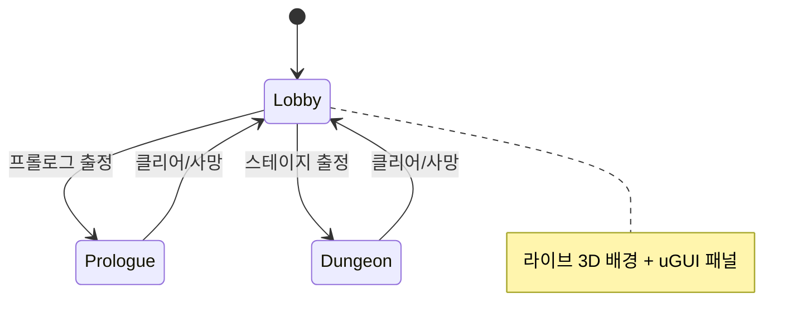

# Abyssal Lantern — Hack & Slash Overhaul (v0.2.0 Frozen Spec)

// FROZEN CONTRACT AMENDMENT #2 — 2026-08-04 인터뷰 확정.
// SIM_SPEC.md(아레나)와 SIM_SPEC_CAMPAIGN.md(캠페인 v0.1)는 유지된다.
// 이 문서는 v0.2.0 전면개편이 **추가/대체**하는 규칙을 정의한다.
// 원작 근거: _workspace 리서치 3종 (로비/RPG메타/3D인게임 리포트, 2026-08-04).

## 0. 모드와 상태머신 (단일 씬)



- **씬은 CinderCourt.unity 하나.** `GameDirector`(View)가 상태 전환 소유.
- URL 계약: `index.html` → Lobby 부팅. `?mode=arena` → 구 무한 아레나(회귀 보존).
  `?mode=prologue`, `?mode=campaign&stage=<id>` → QA 딥링크(잠금 검사 통과 필요).
  `campaign.html` → `index.html` 즉시 리다이렉트로 교체(구 링크 보존).
- 시뮬레이션 모드 3종: `Arena`(기존 그대로, 회귀 게이트), `Prologue`, `Dungeon`.

## 1. Prologue — "등불 점화 훈련" (2D 디펜스 학습)

- 카메라: **수직 탑다운 오소그래픽** (pitch 90°, ortho size = 아레나 세로 반경
  ×1.15). 2D 디펜스로 읽힌다. 클리어 시 카메라가 55° 원근으로 내려오는 2.5D
  전환 연출(2.2 s) 후 로비 복귀.
- 규칙: 아레나 수치 계약 그대로(이동 218, 공격 58/160/0.48, 기름 등).
  스킬/대시/콤보 **비활성** — 이동+기본공격+기름 관찰만.
- 웨이브 3개: 4 / 6 / 8기. 기믹 없음. 보스 없음.
- 튜토리얼 토스트 4단계: 이동(WASD) → 타격(Space) → 기름 게이지 관찰 →
  "웨이브를 비우면 다음이 온다". 각 조건 충족 시 다음 토스트.
- 클리어 → `prologueDone=true` 저장, **캠페인 스테이지 해금은 프롤로그 클리어가
  선행 조건** (신규 유저 흐름: 프롤로그(2D 학습) → 던전(2.5D 본편)).

## 2. Dungeon 전투 킷 (핵엔슬래시)

던전 모드 전용. 아레나/프롤로그 수치는 불변.

### 2.1 기본 콤보 (Space)
| 타 | 피해 | 스윙 | 활성창 | 비고 |
|---|---|---|---|---|
| 1 | 58 | 0.30 s | [0.10, 0.22) | |
| 2 | 58 | 0.30 s | [0.10, 0.22) | |
| 3 | 87 | 0.42 s | [0.14, 0.30) | 넉백 120 px/0.18 s |
- 피해 표기는 **기본 공격력 58 기준 비율 1:1:1.5** — 구현은
  `playerDamage × {1,1,1.5}`이며 메타스탯/장비/레벨/추출 성장 배수가 곱해진다
  (a=w=0, lv=1에서 정확히 58/58/87).
- 콤보 연결: 스윙 종료 후 0.9 s 내 재입력 시 다음 타. 아니면 1타로 리셋.
- 사거리/전방 판정/1스윙 1피격 규칙은 아레나 계약 상속 (160, dx·facing≥-18).
- 던전 적 기본 HP `86 + min(140, (wave-1)*11)` (콤보 DPS 보정).

### 2.2 대시 (Shift)
`{ 거리 190 px, 시간 0.22 s, 무적 전구간, 쿨 1.6 s, 기름 8 }`
- 대시 중 이동 입력 방향(무입력 시 facing). 콤보 캔슬 가능. 아레나 클램프 적용.
- 이벤트 `DashUsed`.

### 2.3 스킬 4종 (Q/E/R/F — 원작 defense-catalog 이식, 비율 스케일)
| 키 | id | 원소 | 효과 | 쿨 | 기름 |
|---|---|---|---|---|---|
| Q | rift-bolt | void | 420 px 내 최근접 적에게 볼트: 145 피해 + 반경 115 스플래시 60% | 6.5 s | 25 |
| E | grave-pulse | ember | 자기 위치 지속 필드: 반경 190, 3 s, 0.5 s마다 26 | 4.0 s | 30 |
| R | ash-nova | ember | 360° 폭발: 반경 230, 110 피해, 넉백 120 | 8.0 s | 45 |
| F | void-aegis | frost | 실드 +40 (피해 흡수, 8 s 또는 소진), 시전 무적 0.2 s | 12.0 s | 30 |
- 스킬은 즉발(캐스팅 바 없음). AoE 링 표시는 **심 판정 반경과 동일**(원작이
  명시 수정한 결함 계승 금지).
- 원작 매핑: R=ash-nova가 구 Nova 계승(비용 45 동일), F=void-aegis가 구 Ward
  계승. 기존 SimInput의 NovaQueued→R, WardQueued→F 재사용, Q/E는 신규 필드.
- 이벤트: `BoltCast`, `PulseCast` 신설 (`NovaCast`/`WardCast` 재사용).

### 2.4 원소 상성 (원작 ELEMENT_MATCHUP 사이클)
`ember > frost > veil > void > ember`. 유리 +20%, 불리 −15%, 그 외 0.
- 적 원소: ember-cohort=ember, scout=frost, shade=veil, possessed=void,
  BossCommander=veil, BossMonarch=void.
- 기본공격/콤보는 무원소(중립). 스킬만 상성 적용.

### 2.5 인런 성장 (XP)
- XP: 일반 처치 10, 정예 25, 보스 150.
- 레벨 곡선(원작): [30, 55, 85, 120, 160, 205, 255, 310], 이후 +60/레벨. 캡 12.
- 레벨업 효과(즉시): 피해 +4%, 최대 HP +6(+6 회복), 기름재생 +0.3/s.
  이벤트 `LevelUp`.

## 3. 정예와 추출 (적을 베어 동료로)

- **정예 스폰**: 던전 웨이브에서 7번째 스폰마다 정예
  (`spawnOrdinal % 7 == 0`, 웨이브당 최대 1). 스탯: HP ×3, 접촉 ×1.5,
  스케일 ×1.35. 뷰: 금색 틴트 펄스.
- **추출**: 정예 사망 → 시체 마커 10 s 유지. 플레이어가 반경 90 px 내에서
  **정지 상태 2.0 s 연속 체류** → 추출 완료(채널 링 UI). 피격 시 채널 리셋.
- 보상: 신규면 로스터 등록(`<visual>-echo`) + 이번 런 피해 +8% 버프.
  중복이면 유물 +30. 웨이브당 추출 1회.
- 이벤트: `EliteDown`, `ExtractionComplete`.

## 4. 동료 (1슬롯 동행)

- 해금: 스테이지 보스 첫 처치 보상 — cinder-span→`ember-cohort`,
  abyss-chancel→`shade-echo`, echo-throne→`possessed-echo`.
  정예 추출 로스터도 장착 가능.
- 로비 군단 탭에서 1체 선택 → 던전 동행.
- 전투: 플레이어로부터 80 px 오프셋 추종, 1.1 s마다 200 px 내 최근접 적에게
  **플레이어 피해의 60%** (상성 무원소). 피격 대상 아님(untargetable).
- 뷰: **기존 7종 메시의 머티리얼 틴트 변형** (신규 메시 금지 — 페이로드 계약).
  동료는 **항상 틴트** (동일 메시 적과 즉시 구분): `-echo` 추출 변형 = 청록,
  보스 보상 동료 = 웜골드. 스케일 0.92.

## 5. 스탯 성장 (메타)

- 획득: 스테이지 클리어 +2 포인트, 보스 첫 처치 보너스 +1.
- 배분(로비 성장 탭): 공격(+3%/pt) · 체력(+8 HP/pt) · 이속(+2%/pt). 캡 각 10.
- 던전 런 시작 시 적용. 프롤로그/아레나엔 미적용.

## 6. 장비 티어 T1–T5 (기존 파편 3슬롯 확장)

- 슬롯 유지: weapon/lantern/cloak. **랭크 0-5 = T0-T5** (기존 효과식 유지:
  무기 +6%/T, 랜턴 +8%/T, 망토 +8HP/T).
- 획득 경로 2종: (a) 기존 인런 드롭(보스 확정 + id%7 파편), (b) **로비 구매**
  — 유물(relic) 화폐로 `[2,4,7,11,16]` 유물/티어.
- 유물은 이제 **메타 화폐**: 런 종료 시 `relics` 누적 저장, 로비에서 소비.

## 7. 보스전 개편

- 보스 웨이브 유지(웨이브 W+1). **페이즈 2** (HP 50%): 이속 +25%, 접촉 ×1.25,
  도발 말풍선. Monarch 한정: 페이즈 전환 시 호위 3기 1회 소환.
  이벤트 `BossPhase2`.
- 보스 HP 바: 화면 상단 대형 바 (이름 + 페이즈 핍).
- 보스 처치 시: 기존 장비 드롭 + 동료 해금 + StageCleared.

## 8. 보스/스토리 말풍선 (원작 SpeechBubbleDirector 이식)

- 월드공간 말풍선 (보스/워든 머리 위), 데이터는 원작 stage-story-catalog 이식:
  | 트리거 | 화자 | 예 |
  |---|---|---|
  | 스테이지 시작 | 감시자(내레이션 캡션) | "서쪽 불씨를 버티고…" |
  | 보스 등장 | 보스 | "등불을 내려라." |
  | 보스 50% (페이즈2) | 보스 | 도발 |
  | 보스 처치 | 워든 | 회고 |
- 홀드 `clamp(1500+58×글자수, 2200..5200) ms`, 우선순위 큐(story>ambient),
  상위 도착 시 하위 클리어. 폰트 서브셋에 대사 전 글자 포함 필수.

## 9. 로비 (단일 씬 Lobby 상태)

- **배경 = 라이브 3D**: 선택 스테이지 백드롭 + 워든 idle + 활성 동료 +
  해당 보스 'show' 루프(원거리 대치 스테이징). 카메라 슬로우 오빗(요 ±6°,
  24 s 랩). 스테이지 액센트 라이트 lerp (cinder #F3592C / chancel #8F67FF /
  throne #72C8FF — 원작 틴트).
- **우측 패널 (출정)**: 프롤로그 카드(미클리어 시 유일 활성) + 스테이지 카드
  3장(잠금/해금/클리어 + 보스명/웨이브/기믹 아이콘/보상 미리보기) + 출정 CTA.
- **좌측 패널 (탭 3개)**: 성장(포인트 배분 +/−) · 장비(3슬롯 T0-T5, 유물 구매)
  · 군단(로스터 그리드, 활성 동료 선택).
- **상단 바**: 타이틀 + 유물 잔액 + 포인트 잔액 + v0.2.0 배지.
- 결과 오버레이(클리어/사망)를 로비 복귀 전에 표시 (점수/처치/획득 요약).
- 접근성: 버튼 최소 44px, 색 단독 의미 금지(원작 계약 계승).

## 10. 레벨/연출 디테일

- 던전 카메라: pitch 55°/FOV 42(원작 검증 수치), 거리 2티어 —
  평시 17, 빅웨이브(생존 적 ≥10 또는 보스) 21, 전환 1.5 s 지수.
  보스 인트로: 1.2 s 푸시인 + 말풍선.
- 스테이지 라이트: 전역 릭 + 스테이지 틴트 lerp(원작 2층 구조).
  모든 포인트 라이트는 보이는 랜턴 프롭(실린더+발광)에 부착(motivated-light).
- 보스 웨이브 시작 시 아레나 클램프 15% 축소(deformation 문법, 원작 보스방
  계약). 텔레그래프 1.5 s (링 표시).
- VFX 추가: 대시 트레일(라인), 콤보 3타 스파크, 레벨업 버스트, 추출 채널 빔,
  정예 사망 마커. 풀 상한 40 + 크리티컬(보스/추출/레벨업) 축출 면제(원작 계약).

## 11. 지속성 (localStorage v2)

키 `"abyssal-lantern:unity:campaign"` 확장(하위호환 — 구 필드 유지):
```json
{"cleared":["cinder-span"],"equipment":{"weapon":2,"lantern":0,"cloak":1},
 "stats":{"attack":3,"vitality":2,"swiftness":0,"points":1},
 "relics":47,"roster":["ember-cohort","scout-echo"],"active":"ember-cohort",
 "prologueDone":true}
```

## 12. SimTypes 증분 (동결 해제 목록 — 이 외 수정 금지)

- `SimInput` 추가 필드: `DashQueued`, `BoltQueued`, `PulseQueued` (bool).
- `SimEvents` 추가: `DashUsed=1<<14`, `BoltCast=1<<15`, `PulseCast=1<<16`,
  `LevelUp=1<<17`, `EliteDown=1<<18`, `ExtractionComplete=1<<19`,
  `BossPhase2=1<<20`, `ComboFinisher=1<<21`.
- 신규 `HackTypes.cs`: `GameMode`, `Element`, `HackConfig`(mode, stage,
  metaStats, equipTiers, companionId, hazards), `IHackSnapshot : ICampaignSnapshot`
  (Level, Xp, XpNext, ComboIndex, DashCooldown, SkillCooldowns[4], Shield,
  ElitesAlive, ExtractionProgress/Target, CompanionX/Y/Attacking, BossHp/BossMaxHp/
  BossPhase, Mode).
- `CinderSim`에 `CinderSim(in HackConfig)` 오버로드. 기본/캠페인 생성자 불변.

## 13. 결정론

전 모드 RNG 금지. 정예 판정·추출·동료 공격 주기 전부 모듈러/카운터 산술.
같은 config+입력 → 같은 Digest. 아레나 기존 20테스트 + 캠페인 10테스트는
회귀 게이트로 계속 통과해야 한다.

## 14. 릴리즈 (v0.2.0)

- README 개편: 배지(Play·Version v0.2.0·Unity 6000.5.6f1·Tests·Pages Deploy),
  게임 소개(KR), 조작표, 스크린샷, 빌드/테스트 방법, 페이지 구성.
- `docs/RELEASE_NOTES.md` v0.2.0 항목.
- git tag `v0.2.0` + `gh release create` (릴리즈 노트 + 플레이 영상 첨부).
- 배포: gh-pages 갱신 후 프로덕션 스모크.
