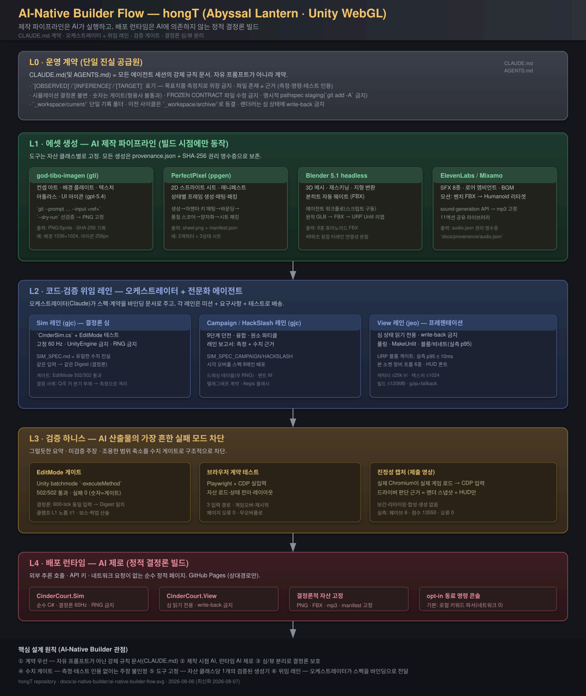

# AI-Native Builder Flow — hongT (Abyssal Lantern · Unity WebGL)

> 이 문서는 `/Users/supercent/orca/hongT` 저장소가 **AI-native builder** 관점에서
> 어떤 플로우로 작업하도록 설계되어 있는지를 정리한다. 즉, "사람이 에이전트를
> 어떻게 굴리도록 프로젝트가 구조화되어 있는가"를 단일 그림과 계층 설명으로
> 문서화한다.

- 작성일: 2026-08-06
- 범위: 저장소 루트 계약(`CLAUDE.md` / `AGENTS.md`) · 워크스페이스(`_workspace/`)
  · 에셋 파이프라인(`docs/*pipeline*.md`) · 위임 레인(`engineering/gjc-*`, `jeo-*`)
  · 검증 게이트 · 배포 런타임
- 시각화: [`ai-native-builder-flow.svg`](ai-native-builder-flow.svg)

---

## 0. 한 줄 요약

**제작 파이프라인은 AI 에이전트가 실행하고, 배포 런타임은 AI에 의존하지 않는
정적 결정론 빌드다.** 이 저장소는 단일 계약 문서가 모든 세션을 강제하고,
오케스트레이터가 전문화 에이전트 레인에 스펙을 바인딩 문서로 위임하며, 모든
주장이 수치 게이트(측정·테스트 인용)를 통과해야만 다음 단계로 승격되는 구조로
설계되어 있다.

---

## 1. 전체 플로우 (SVG)



```
L0 운영 계약 (CLAUDE.md · AGENTS.md)
        │ 강제 규칙 · 수치 게이트 · 증거 규율
        ▼
L1 에셋 생성 ──── god-tibo-imagen · perfectpixel · Blender headless · ElevenLabs/Mixamo
        │ (빌드 시점에만 동작, provenance + SHA-256 보존)
        ▼
L2 코드·검증 위임 레인 ──── Sim(gjc) · Campaign/HackSlash(gjc) · View(jeo)
        │ 오케스트레이터(Claude)가 스펙을 바인딩 문서로 전달
        ▼
L3 검증 하니스 ──── EditMode 게이트 · Playwright/CDP 브라우저 계약 · 진정성 캡처
        │ (숫자 = 게이트; 형용사는 통과 불가)
        ▼
L4 배포 런타임 ──── 정적 WebGL · Sim/View 분리 · AI 제로 (opt-in 명령 콘솔 예외)
```

---

## 2. L0 — 운영 계약: 단일 진실 공급원

이 프로젝트가 AI-native builder로 동작하는 **첫 번째 설계 결정**은 자유 형식
프롬프트 대신 **강제 규칙 문서**를 두는 것이다.

| 계약 조항 | 내용 | 실패 모드 차단 |
|---|---|---|
| 증거 표기 | `[OBSERVED]` / `[INFERENCE]` / `[TARGET]` — 목표치를 측정치로 위장 금지 | 그럴듯한 요약 |
| 근거 규칙 | "파일이 존재한다는 사실은 근거가 아니다" — 측정·명령·테스트 결과 인용 | 미검증 주장 |
| 결정론 불변 | 시뮬레이션은 결정론적 고정 60Hz · 렌더러는 심 상태에 write-back 금지 | 상태 파괴 |
| 수치 게이트 | "숫자는 게이트다. 형용사는 게이트를 못 통과한다" | 모호한 회고 |
| 동결 계약 | `// FROZEN CONTRACT` 파일은 위임 에이전트가 수정 불가 | 계약 드리프트 |
| 워크스페이스 | 산출물은 `_workspace/current/` 단일 폴더 · 이전 사이클은 `archive/` 동결 | 세션 간 충돌 |
| git 규율 | 명시적 pathspec staging · `git add -A` 금지 | 무단 커밋 |

`AGENTS.md`는 비-Claude 런타임(Codex · Gemini · OpenCode · gjc · jeo)이 같은
규칙을 해석하도록 둔 단일 진입점이다. "두 번째로 흩어진 복사본"을 만들지 않는
설계다.

---

## 3. L1 — 에셋 생성: 자산 클래스당 하나의 고정 도구

AI-native builder 관점의 두 번째 결정: **도구를 자산 클래스별로 고정**한다.
매번 모델/도구를 다시 고르지 않고, 클래스마다 검증된 생성기를 계약처럼 사용한다.

| 자산 클래스 | 도구 | 산출물 | 근거 |
|---|---|---|---|
| 컨셉 · 배경 · 텍스처 · 아틀라스 · UI 아이콘 | god-tibo-imagen (`gti`, gpt-5.4) | PNG · 아이콘 시트 | `provenance.json` + SHA-256 |
| 2D 스프라이트 시트 · 매니페스트 | PerfectPixel (`ppgen`) | `sheet.png` + `manifest.json` | 프레임 품질 스코어 |
| 3D 메시 · 재스키닝 · 지형 변환 | Blender 5.1 headless | FBX 8종 · 터레인 파츠 | `engineering/reskin/*.json` |
| 사운드 · 모션 | ElevenLabs sound-gen / Mixamo 리타겟 | mp3 고정 · 11액션 라이브러리 | `docs/provenance/audio.json` |

**설계 의도 (문서에서 확인된 사례):**
- 배경 프롬프트에 `no magenta`를 강제 → 뒤이은 스프라이트 마젠타 키 매팅과의
  팔레트 충돌을 **파이프라인 전체에서 원천 차단**. 아트 지시가 곧 게임플레이
  가독성 사양이 되는 사례.
- 모든 생성물은 SHA-256 권리 영수증과 함께 저장소에 보존되어 재현 가능.
- 생성 어댑터는 임시 로컬 구성이며, **배포된 게임은 어느 생성기에도 의존하지 않는다.**

---

## 4. L2 — 코드·검증 위임 레인

세 번째 결정: **오케스트레이터가 모든 것을 직접 쓰지 않고, 전문화 에이전트
레인에 스펙을 바인딩 문서로 위임**한다. `_workspace/current/engineering/`에
레인 단위 런북(`gjc-sim-lane.md`, `gjc-campaign-lane.md`, `gjc-hackslash-lane.md`,
`jeo-view-lane.md`)이 그 증거다.

레인 런북의 구조 (예: `gjc-sim-lane.md`):

```text
LANE: Deterministic Simulation (owner: gjc)
Mission     → "CinderSim.cs 하나와 EditMode 테스트를 작성한다.
               다른 파일 생성/수정 금지."
Binding docs → SIM_SPEC.md(유일한 수치 진실) + SimTypes.cs(FROZEN CONTRACT)
Requirements → 결정론 600-tick Digest 일치 · 클램프 L1 노름 ≤1 ·
               Nova/Ward 경계값 · 픽업 id%3 · 보스 산술 · 공격판정
성능         → 힙 할당 최소화 · LINQ 금지 · foreach 대신 for
```

| 레인 | 오너 | 범위 | 게이트 |
|---|---|---|---|
| Deterministic Sim | gjc | `CinderSim.cs` + 테스트 | EditMode 결정론 Digest |
| Campaign | gjc | 6단계 던전 · 융합 · 파티클 | 레인 보고서 수치 근거 |
| HackSlash | gjc | 시각 오버홀 스펙 8레인 | 드레싱 테이블 무 RNG |
| View | jeo | 프레젠테이션(읽기 전용) | 풀링 · MakeUnlit · p95 게이트 |

충돌 시 규율: `conflicts.md`가 크로스 세션 충돌을 기록하고, "최소 침습 수정"을
선택하며, 비선택 대안과 후속 조치를 명시한다(예: `CharacterRosterAnimationTests`
컴파일 차단 사례).

---

## 5. L3 — 검증 하니스: 수치 게이트

네 번째 결정: **검증을 사람의 리뷰가 아니라 실행 가능한 하니스로 만든다.**
AI 산출물의 가장 흔한 실패 모드(그럴듯한 요약 · 미검증 주장 · 조용한 범위 축소)를
구조적으로 차단한다.

| 게이트 | 도구 | 검증 내용 |
|---|---|---|
| EditMode | Unity batchmode `-executeMethod` | 166/166 통과 · 실패 0 · 결정론 · 웨이브 산술 · 보스 HP |
| 브라우저 계약 | Playwright + CDP 실입력 | 자산 로드 · 상태 전이 · 레이아웃 무오버플로 · 입력 3경로 · 오류 0 |
| 진정성 캡처 | `capture-unity-play.mjs` | 실제 Chromium → 실제 게임 → CDP 키 입력 → 실프레임 인코딩 (합성 없음) |

**대표적 실패 격리 사례** (AI가 잡아낸 치명적 결함): HUD가 `Q Ember Nova`를
광고하지만 45초 자동 플레이에서 Q 입력 82회에 기름 소모 0 → `handleKeyDown`에
`KeyQ`/`KeyE` 분기 부재와 버튼 리스너 미바인딩을 측정으로 격리 → 수정 후
세 입력 경로 전부 복구 검증. "코드를 대신 쓰게 하는 것이 아니라, **사람이
놓치는 것을 측정으로 잡게** 하는" 것이 이 팀의 AI 사용 방식이라는 문서 선언이
설계 원칙으로 실증된 사례다.

---

## 6. L4 — 배포 런타임: AI 제로

다섯 번째 결정: **런타임에는 AI가 한 줄도 실행되지 않는다.**

- 배포물은 외부 추론 호출 · API 키 · 네트워크 요청이 없는 순수 정적 페이지
  (GitHub Pages, 상대경로만).
- `CinderCourt.Sim` = 순수 C# 결정론 심(60Hz, RNG 금지), `CinderCourt.View` =
  심 읽기 전용 프레젠테이션.
- AI는 제작 시점에만 동작하고, 산출물은 결정론적 자산/코드로 고정.
- **단 하나의 opt-in 예외** — 동료 명령 콘솔: 기본 경로는 로컬 키워드 파서
  (네트워크 0)이고, 플레이어가 **자신의** Gemini 키를 런타임에 직접 등록한
  경우에만 자유문장 분류에 사용. 키는 빌드·저장소에 미포함, 응답은 의도 단어
  1개로 제한, 네트워크 실패는 Unknown으로 강등. **시뮬레이션은 어떤 경로로도
  AI 출력에 의존하지 않는다.**

---

## 7. 설계 원칙 요약 (AI-Native Builder 관점)

1. **계약 우선** — 자유 프롬프트가 아닌 강제 규칙 문서. 모든 런타임이 같은 계약 해석.
2. **제작 시점 AI, 런타임 AI 제로** — AI는 파이프라인이지 기능이 아님.
3. **심/뷰 분리** — 결정론은 불변 조건. 렌더러는 읽기만 가능.
4. **수치 게이트** — 측정·테스트 인용 없이는 주장 불인정. 목표치 위장 금지.
5. **도구 고정** — 자산 클래스당 하나의 검증된 생성기. 프롬프트 충돌 사양은 사전 차단.
6. **위임 레인** — 오케스트레이터가 스펙을 바인딩 문서로 전달. 레인은 미션+테스트로 배송.
7. **증거 보존** — provenance.json + SHA-256 + 레인 보고서로 재현 가능성 보장.
8. **진정성 하니스** — 제출 영상까지 실제 입력·실프레임으로만 생산.

---

## 8. 산출물 위치

| 파일 | 설명 |
|---|---|
| `docs/ai-native-builder/ai-native-builder-flow.svg` | 플로우 시각화 (L0–L4) |
| `docs/ai-native-builder/ai-native-builder.md` | 본 문서 |
| `docs/ai-native-builder/ai-native-builder.pdf` | PDF 변환본 |

### 재생성 방법 (PDF)

```bash
# SVG → PDF 프리뷰용 PNG (필요 시)
rsvg-convert -w 1280 docs/ai-native-builder/ai-native-builder-flow.svg \
  -o docs/ai-native-builder/ai-native-builder-flow.png

# MD → PDF (Chrome headless HTML 경로, 한글 폰트 유지)
pandoc docs/ai-native-builder/ai-native-builder.md -f gfm -t html5 \
  --standalone --metadata title="AI-Native Builder Flow — hongT" \
  -o docs/ai-native-builder/ai-native-builder.html
"/Applications/Google Chrome.app/Contents/MacOS/Google Chrome" --headless \
  --disable-gpu --print-to-pdf=docs/ai-native-builder/ai-native-builder.pdf \
  --no-pdf-header-footer docs/ai-native-builder/ai-native-builder.html
```
