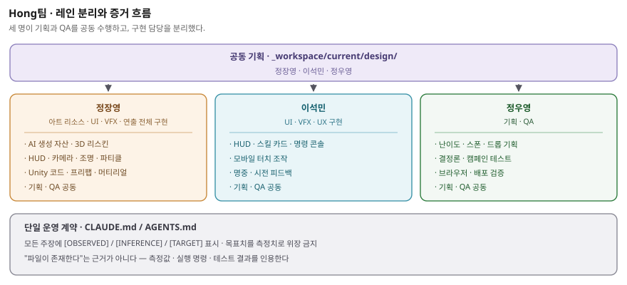

# 1. 팀 구성

팀명은 **Hong팀**이며, 정장영·이석민·정우영으로 구성된 3인 팀입니다. 세 명 모두
기획과 QA를 공동 수행했고, 구현 담당은 다음과 같이 분리했습니다. 정장영은
아트 리소스·UI·VFX·연출 전반을 구현했으며, 이석민은 UI·VFX·UX 구현을
담당했습니다. 정우영은 기획과 QA를 담당했습니다.

| 이름 | 담당 역할 |
|---|---|
| **정장영** | 기획·QA 공통 · 아트 리소스·UI·VFX·연출 전체 구현 |
| **이석민** | 기획·QA 공통 · UI·VFX·UX 구현 |
| **정우영** | 기획·QA 공통 |

---

# 2. 팀원별 담당 영역

## 2.1 정장영 — 기획·QA(공통) / 아트 리소스·UI·VFX·연출 전체 구현

**기획 (공통)**

- 게임 콘셉트 및 코어 루프 정의: 웨이브 방어 + 등불 기름 자원 배분
- 전투 수치 설계: 워든의 공격 사거리(160)를 적(76)보다 두 배 넘게 길게 잡아,
  거리를 유지하며 치고 빠지는 실력이 곧 생존이 되도록 이동속도·재사용 대기시간을
  조정


**아트 리소스 구현**

- AI 자산 생성 파이프라인 운용 — god-tibo-imagen / PerfectPixel `ppgen`로 UI
  아이콘(`Assets/Resources/Icons/`)을 만들고, Blender(무료 3D 툴)를 화면 없이
  자동 실행해 캐릭터 3D 모델의 뼈대와 움직임을 다시 입힘(근거
  `docs/provenance/lantern-reaver-reskin.json`, `docs/character-asset-pipeline.md`)
- 지형 구현 — 원작 지형 3D 파일을 Blender로 변환한 뒤 게임 엔진 재질로 다시 칠해
  9단계 스테이지가 공유하는 바닥·소품 조각(`Assets/Resources/Terrain/`) 구성
- 색상 규칙 수립: 배경 지우기용 키 색과 겹치지 않도록 마젠타(자홍) 계열을 전면
  금지하고, 아군은 시안(청록)으로 적과 색을 분리해 난전에서 즉시 구분되게 함
- 생성한 자산의 출처(프롬프트·모델·해시)를 `docs/provenance/`에 기록

**VFX·연출 구현**

- `VfxDirector.cs`·`PostFxGate.cs` 구현 — 불꽃 등 원소 파티클, 스킬 시전 순간의
  빛 번짐, 화면 밝기 강조(블룸)와 가장자리 어둡게(비네트) 효과. 성능이 규정
  예산(프레임당 처리 시간) 안에 들도록 제한을 걸어둠
- `AudioDirector.cs` 사운드 연출 — 게임 이벤트에 맞춰 효과음(mp3) 재생과 배경음악
  반복. 같은 소리를 빠르게 연타하면 겹쳐서 웅웅거리는 문제를, 6개의 재생 채널을
  번갈아 쓰고 음높이를 ±6% 살짝 흔들어 해결(효과음은 ElevenLabs로 생성,
  근거 `docs/provenance/audio.json`)
- 카메라·조명 연출(`CameraRig.cs`)과 스테이지 배경 배치 구성


## 2.2 이석민 — 기획·QA(공통) / UI·VFX·UX 구현

**기획 (공통)**

- 온보딩 설계: 튜토리얼 없이 첫 화면에서 목표·조작·상태가 동시에 읽히도록
  정보 구조 정의
- 세계관 텍스트 설계 — 진행에 따라 열리는 로어 비트(`StoryCatalog.cs`)

**UI 구현**

- `HudView.cs`로 화면 정보창(HUD) 전반 구현 — 등불 무결성·기름 게이지, 웨이브·
  점수·남은 적·유물 수치 표시, 던전 스킬 아이콘(Q/E/R/F·대시), 콤보 표시, 보스
  체력바, 탈출 게이지
- 스킬 카드 상태 표기: 재사용 대기 남은 시간, 기름 부족, 사용 가능(Ready)을 각각
  다르게 표시해 "왜 지금 못 쓰는지"가 바로 보이게 함
- 텍스트 명령 콘솔 화면 구현 — `Enter`로 열리는 입력창, 한국어 안내 문구, 명령을
  칠 때 잠깐 느려지는 힌트 연출(`HudView.SubmitCommand` / `ApplyCommandIntent`)

**UX(사용 경험) 구현**

- 모바일 조작: 방향 패드·가상 조이스틱·공격 버튼을 만들어 키보드 없이도 PC와
  똑같이 조작 가능(`InputAdapter.cs`의 터치 경로)
- 스킬 시전 순간의 화면 반짝임, 스테이지 클리어 연출 등 피드백 타이밍 구성

**VFX 협력**

- 스킬 시전 빛 번짐, 명중 시 뜨는 데미지 숫자(`DamageNumberPool.cs`) 등 화면
  효과가 실제 게임 상태와 어긋나지 않게 구현·검증


## 2.3 정우영 — 기획·QA(공통)

**기획**

- 난이도 곡선 설계: 웨이브별 증원 규모·스폰 간격, 웨이브 간 정비 구간
- 드롭 설계: Ember shard(+18 체력) / Oil flask(+35 기름) / Relic mote(+250 점수)
  3종 순환과 12초 수명 · 78 자력 반경

**QA (품질 검증)**

- 자동 테스트 게이트 운용 — `Assets/Tests/EditMode/`에 있는 검증들: 계산 규칙이
  항상 같은 결과를 내는지(`CinderSimTests.cs`, `CampaignSimTests.cs`,
  `HackSimTests.cs`), 명령 해석이 정확한지(`CompanionCommandParserTests.cs`),
  캐릭터 동작(`ClipTableTests.cs`, `PoseResolveTests.cs`), 화면 배치
  (`HudLayoutTests.cs`), 웹 빌드 텍스처 용량 제한(`WebGlTextureCapTests.cs`)
- 규칙 준수 검증: 화면·소리·효과 담당 코드가 게임의 핵심 계산 결과를 몰래 바꾸지
  않는지 확인(게임이 항상 똑같이 재생되도록 하는 안전장치)
- 플레이 영상 점검 — 공개 YouTube 제출본의 실제 게임 화면과 링크 접근성을 확인
- 배포 점검: GitHub Pages에 올라가는 파일이 저장소에 커밋된 것만으로 만들어지는지 확인


---

# 3. 협업 · 분업 방식

## 3.1 단일 운영 계약

세 명이 각자 다른 도구·세션에서 작업하되, 저장소 루트의 `CLAUDE.md`(및 이를
가리키는 `AGENTS.md`)를 **단일 운영 계약**으로 공유했습니다. 규칙이 한 곳에만
존재하므로 담당자별로 다른 관행이 생기지 않습니다.

## 3.2 레인 분리

작업 산출물은 `_workspace/current/` 아래 담당 레인에 배치합니다.



| 레인 | 소유 | 담는 것 |
|---|---|---|
| `_workspace/current/design/` | 3인 공동 | 기획·수치·서사 결정 |
| `_workspace/current/engineering/` | 정장영 | 구현·자산 파이프라인 |
| `_workspace/current/ui/` | 이석민 | UI·UX 사양 및 근거 |
| `_workspace/current/qa/` | 3인 공동 | 검증 결과 |
| `_workspace/current/production/` | 정우영 | 태스크 매니페스트 · 게이트 상태 |

**잘못된 레인에 놓인 파일은 사소한 실수가 아니라 결함으로 취급**합니다. 증거의
소유자가 불분명해지면 검증이 무너지기 때문입니다.

## 3.3 증거 규약

모든 주장에 `[OBSERVED]`(직접 확인함) / `[INFERENCE]`(추론) / `[TARGET]`(목표치)를
표시합니다. 목표치를 이미 달성한 측정값처럼 적는 것을 금지하며, "파일이 있다"는
사실만으로는 근거로 인정하지 않습니다. 실제 측정값·실행한 명령·테스트 결과를
함께 제시해야 합니다.

## 3.4 동시 작업 안전장치

여러 세션이 같은 저장소를 동시에 편집하므로 다음을 강제했습니다.

- 커밋 전후로 `git status --short`를 확인하고, 예상치 못한 변경은 다른 담당자의
  작업으로 간주한다
- 명시적 경로만 스테이징한다. `git add -A` / `git add .` 금지
- 다른 담당자의 변경을 되돌리거나 덮어쓰지 않는다. 충돌 시 중단하고 기록한다
- 푸시 전 upstream을 명시적으로 페치하고 `@{upstream}..HEAD` 범위를 확인한다.
  force-push 금지

## 3.5 실제 협업 사례 — 동료 명령 콘솔

동료 명령 콘솔(게임 중 글자로 명령을 입력하는 창)은 세 담당의 작업이 한 지점에서
맞물리는 대표 사례입니다.

| 단계 | 담당 | 내용 |
|---|---|---|
| 명령 해석기 구현 | 구현(정장영) | `CompanionCommandParser.Parse`가 플레이어가 입력한 한국어 문장을 미리 정해둔 몇 개의 명령으로 분류합니다. 구체적인 단어("결계")를 넓은 단어("방어")보다 먼저 인식하도록 순서를 고정했습니다 |
| 입력 연결 | 구현 | `HudView.SubmitCommand` → `ApplyCommandIntent` → `InputAdapter`로 이어져, 콘솔 명령이 키보드 입력과 **똑같은 경로**로 게임에 전달됩니다 |
| UI 피드백 | UI(이석민) | 화면에 뜨는 한국어 안내 문구를 실제 동작에 맞춰 정직하게 표기 — 동료에게 내리는 명령은 "수호자: …", 스킬 사용은 "…시전". 콘솔 입력창과 슬로우모션 힌트 줄도 구현 |
| QA 검증 | QA(정우영) | `Assets/Tests/EditMode/CompanionCommandParserTests.cs`로 문장이 의도한 명령으로 정확히 분류되는지, 알 수 없는 문장은 실행 없이 안내만 뜨는지 반복 검증 |

기본 동작은 인터넷 연결 없이 게임 안에서 처리되는 로컬 해석기입니다. 원격
Gemini는 플레이어가 자기 API 키를 직접 등록했을 때만 켜지는 선택 기능
(`GeminiCommandClient.cs`, `KeyVault.cs`)이므로, **게임의 실제 진행은 어떤
경우에도 AI 응답에 의존하지 않습니다.** 이 원칙을 QA가 검증합니다.


---

# 4. 기여 확인 방법

저장소의 커밋 기록(누가 언제 무엇을 바꿨는지 남는 변경 이력)으로 담당별 기여를
확인할 수 있습니다.

```bash
git log --oneline --stat            # 전체 변경 이력
git log --format='%an %s' | sort | uniq -c   # 작성자별 커밋 수
```


- 저장소: <https://github.com/akillness/hongT>
- 배포: <https://akillness.github.io/hongT/>
